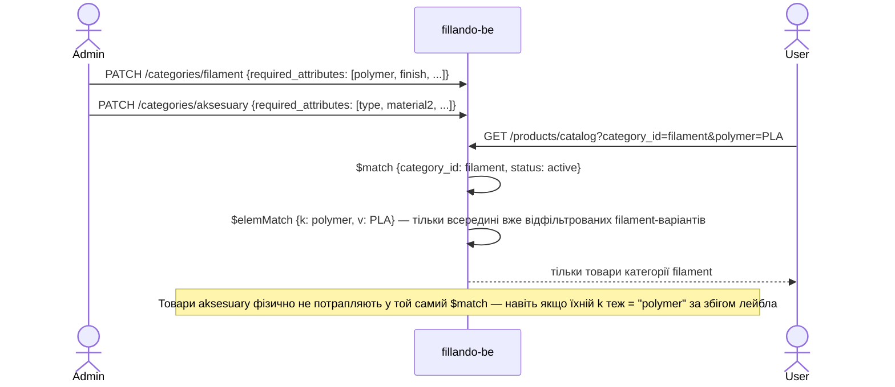

# TD-0005 — Ізоляція каталогу по категоріях

- **Status:** Approved (2026-09-06)
- **Author:** vvbogdanovih
- **Reviewers:** рецензія 2026-09-06 — [TD-0005-review.md](TD-0005-review.md): застарілі місця §3.1/§5.1 оновлені проти `dev`, §5.3 переоцінено, два питання §8 закриті
- **Date:** 2026-09-01 (аудит коду); переглянуто 2026-09-06
- **Components:** both (fillando-be, fillando-fe)
- **Related:** [Plan-0002 roadmap](../plans/plan-0002-catalog-seo-roadmap.md) · [TD-0002](TD-0002-catalog-taxonomy-and-landings.md) · [FRD §4.1](../requirements/FRD.md) · [FRD §11](../requirements/FRD.md)

## 1. Summary

Fillando сьогодні продає тільки філамент, але за роадмапом (Plan-0002, Фаза 4)
з'являться інші категорії — «Аксесуари» та інші супутні матеріали. У
довгостроковій перспективі сайт буде приблизно на 90%, не на 100%, про
пластик. TD-0002 (таксономія філаменту, кольори, лендінги) — перший TD, що
вводить структуровані атрибути на рівні категорії; при рев'ю виникло
питання, чи не заточені ці рішення під філамент настільки, що ускладнять
життя майбутнім категоріям.

Цей документ фіксує контракт ізоляції каталогу по категоріях: що вже
працює саме так у коді сьогодні (підтверджено аудитом `fillando-be`,
2026-09-01), що є навмисно спільним для всього каталогу, і одне відоме
прийняте обмеження. Мета — щоб TD-0002 і кожен наступний TD категорії
(«Аксесуари» тощо) посилались на один спільний контракт замість того, щоб
щоразу заново доводити, що нові атрибути нікуди не «протечуть».

## 2. Goals / Non-goals

**Goals**

- Один раз явно зафіксувати, які частини каталогу — per-category (незалежні
  для кожної категорії), а які — навмисно спільні для всього каталогу.
- Дати кожному майбутньому TD категорії одне посилання замість повторного
  доведення ізоляції.
- Явно задокументувати відоме прийняте обмеження (`generateAttrKey`) і
  умову, за якої його треба буде усунути.
- Зафіксувати виконувану (не тільки писану) гарантію: рекомендувати
  regression-тест, що ловить порушення ізоляції автоматично.

**Non-goals**

- Не проєктує атрибути/таксономію для «Аксесуарів» чи інших майбутніх
  категорій — окремий TD, коли буде відомий реальний асортимент (Plan-0002
  Фаза 4).
- Не змінює жодної схеми чи коду — архітектура вже задовольняє цей контракт
  (§3). Це задокументований контракт і guardrails, а не рефакторинг.
- Не вирішує, коли саме запускати нові категорії — це роадмап-рівень
  (Plan-0002).

## 3. Background & context

### 3.1 Що є сьогодні (аудит `fillando-be`, 2026-09-01)

`Category` — плоска, `required_attributes` це embedded-масив **на кожному
документі категорії**, не глобальний конфіг:

```ts
// database/mongoose/schemas/category.schema.ts
@Schema({ _id: false })
class RequiredAttribute { key; label; filter_type: 'multi-select' | 'range'; unit }

@Schema({ collection: 'categories', timestamps: true })
class Category {
  name: string       // unique
  slug: string        // unique
  required_attributes: RequiredAttribute[]   // default []
  image: string | null
  order: number
}
```

`Product.attributes` — масив `{k, l, v}`, `k` виводиться з `l` через
`generateAttrKey` (`common/utils/attribute.utils.ts:64-76`, стан на
2026-09-06) — **тільки з тексту лейбла**, без `category_id`. Після Plan-0004
PR-0a перед транслітерацією стоїть глобальна мапа `ATTR_KEY_OVERRIDES`
(`:51-57`), яка категорії теж не знає:

```ts
export const ATTR_KEY_OVERRIDES = {
  'тип пластику': 'polymer', 'ефект поверхні': 'finish',
  'армування': 'reinforcement', 'серія': 'series', 'котушка в комплекті': 'spool_included'
}
export function generateAttrKey(label: string): string {
  const normalized = normalizeAttrLabel(label)
  if (Object.hasOwn(ATTR_KEY_OVERRIDES, normalized)) return ATTR_KEY_OVERRIDES[normalized]
  return label.normalize('NFD').toLowerCase()
    .split('').map(ch => CYRILLIC_MAP[ch] ?? ch).join('')
    .replace(/[\s-]+/g, '_').replace(/[^a-z0-9_]/g, '')
}
```

Викликається лише з `attr.label`/`attr.l` — `category.service.ts:31`,
`product.service.ts:261,305`. Ніде не бере участі `category_id`. Мапа має
два дзеркала, які змінюються разом із нею: `toAttrKey` у фронтенді
(`common/utils/slug.utils.ts`) і `scripts/fillando_v_2/normalize-attr-keys.js`.

Каталожна фільтрація (`product-variant.repository.ts:588-806`,
`findCatalogItems`) вимагає `category_id` як обов'язковий параметр і матчить
його в кожному з **чотирьох** під-пайплайнів — основному, діапазону цін,
опцій фільтрів і (новий після Plan-0004) опцій кольору:

```ts
async findCatalogItems(params: { category_id: string; colorFamilies?; ...attrFilters }) {
  const variantMatch = { category_id: new Types.ObjectId(category_id), status: ProductStatus.ACTIVE }
  // + той самий $match на category_id у priceRangePipeline (:712), filterOptionsPipeline (:717)
  //   і colorOptionsPipeline (:747-751, додатково color_id: { $ne: null })
  const attrConditions = Object.entries(attrFilters).map(([key, values]) => ({
    'product.attributes': { $elemMatch: { k: key, v: { $in: values } } }
  }))
}
```

`ProductService.getCatalog` (`product.service.ts:213-238`) кидає
`BadRequestException`, якщо `category_id` відсутній (`:217`) — атрибутна
фільтрація без категорії неможлива на рівні API, не тільки за конвенцією.
Резервовані ключі запиту винесені в `CATALOG_RESERVED_KEYS` (`:616-624`:
`category_id`, `page`, `limit`, `price_min`, `price_max`, `sort`,
`color_family`); `color_family` іде окремим параметром, бо колір живе на
варіанті, а не в `attributes`.

Винятки, навмисно спільні для всього каталогу: `ProductService.search`
(`product.service.ts:143-160`, `findSearchResults`) — текстовий/SKU-пошук без
`category_id`, без атрибутних фасетів; SKU-гілка бере id лише з ACTIVE
(`findBySkuPrefix`). І `findPriceSheet` (публічний прайс-шит) — матчить лише
`status`, теж без фасетів. Обидва не порушують контракт нижче.

Колір після Plan-0004 (у `dev` з 2026-09-04) — це `ProductVariant.color_id`
(nullable) + денормалізований `color_family` + спільний словник `colors`
(`color.schema.ts`: `name_en`, `name_uk`, `slug`, `family`, `hex_stops`,
`order`). Евристика `pickColor`/`COLOR_PATTERNS`
(`product-attribute.helpers.ts`) лишилась **фолбеком** для варіантів без
`color_id` у прайс-шиті (`product.service.ts:192`) і єдиним джерелом в
адмінському прайс-листі PDF (`price-list.service.ts:179`). Перша редакція TD
формулювала контракт як `variant_type.key === 'color'` — **так код не
працює і не міг**: ключ виводиться з українського лейбла через
`generateAttrKey`, тож у реальній базі він `kolir`
(`scripts/fillando_v_2/normalize-variant-colors.js:106-118` документує це й
матчить `'color' || 'kolir'`). Спільний контракт — `color_id`, див. §5.1.

Другої категорії в базі фізично немає; у коді «Аксесуари» з'являються лише
як фікстура int-тесту (`product-variant-landing-count.int-spec.ts:44`).
Міграції TD-0002 лежать у `scripts/fillando_v_2/` (13 скриптів), а не в
`scripts/migrations/`, де лишилися лише старі разові скрипти. `Vendor` має
лише `name` + `slug` (без `logo`/`description`/SEO-полів) і є постачальником,
не виробником (TD-0006 §3.2).

### 3.2 Чому це TD окремо від TD-0002

Контракт нижче стосується не тільки філаменту — він має діяти і для
«Аксесуарів», і для будь-якої наступної категорії. Якби він жив усередині
TD-0002, кожен наступний TD категорії мусив би або дублювати цей розділ,
або посилатись на TD про філамент, що семантично дивно. Тому — окремий,
короткий, стабільний документ.

## 4. Requirements

**Функціональні**

- Набір атрибутів (`required_attributes`), введений для однієї категорії,
  не вимагається і не мається на увазі для іншої категорії.
- Каталожний браузинг/фільтрація завжди працює в межах одного `category_id`;
  крос-категорійна атрибутна фільтрація — постійний non-goal, не тимчасове
  обмеження.
- Спільні словники (наприклад, `colors`) підтримують «неприйнятно» для
  категорій/товарів, де концепція не застосовується (nullable-поле).

**Нефункціональні**

- Без нових `$lookup` чи індексів **заради ізоляції** — вона вже
  забезпечується наявним `$match` по `category_id`. Індекс
  `{ category_id, status, color_family }`, доданий Plan-0004 для
  swatch-фільтра (`product-variant.schema.ts:83`), category-first, тобто
  підтримує контракт, а не обходить його.

## 5. Proposed design

### 5.1 Контракт: per-category vs спільне

| Що | Per-category чи спільне | Де це видно в коді |
|---|---|---|
| `required_attributes` (набір і значення атрибутів) | **Per-category** — embedded-масив на документі `Category` | `category.schema.ts` |
| Атрибутна фільтрація каталогу (`findCatalogItems`) | **Per-category** — `category_id` обов'язковий, матчиться в кожному з чотирьох під-пайплайнів | `product-variant.repository.ts:588-806` |
| Per-category налаштування (`google_product_category`, TD-0006) | **Per-category** — embedded на `Category`, тим самим патерном, що `required_attributes`/`image`; перший зовнішній споживач контракту | TD-0006 §3.3, §5.2 |
| Одноразові міграції таксономії (напр. `derive-material-taxonomy.js` з TD-0002) | **Per-category за задумом**, хоч і не за фільтром у коді — безпечні сьогодні, бо іншої категорії не існує (§5.4) | `scripts/fillando_v_2/` (TD-0002 §9) |
| Лендінги: сторінка `[category]/[landing]`, `findActiveByCategoryAndSlug`, лічильники `countVariantsForLandings` | **Per-category** — колекція, роут і лічильник скоповані; slug унікальний у межах категорії | `landing.schema.ts:75`, `landing.repository.ts:46-52`, `product-variant.repository.ts:141` |
| Лендінги: список `GET /landings` без `category_id`, `GET /landings/slugs` | **Спільне навмисно** — адмінка й sitemap читають усі; вітрина завжди передає категорію | `landing.controller.ts:43-48`, `landing.repository.ts:26-31,64-91` |
| Словник `colors` / `ColorFamily`; `ProductVariant.color_id` (nullable) як індикатор кольорової осі | **Спільне навмисно** — колір як вимір шопінгу однаковий для будь-якої категорії; варіант без кольору має `color_id: null`, і це не помилка. **Не** `variant_type.key === 'color'` — такого індикатора в коді немає (§3.1) | `color.schema.ts`, `product-variant.schema.ts:67,75` |
| Повнотекстовий пошук (`ProductService.search`) і прайс-шит (`findPriceSheet`) | **Спільне навмисно** — крос-категорійні за задумом, без атрибутних фасетів | `product.service.ts:143-160`, `product-variant.repository.ts:461-` |
| `generateAttrKey` (лейбл → `k`) + `ATTR_KEY_OVERRIDES` | **Глобальна функція і глобальна мапа, без урахування категорії** — див. §5.3 (відоме обмеження) | `attribute.utils.ts:51-76` |
| Презентація атрибутів на вітрині: людські підписи значень, порядок таблиці характеристик, семантика рефілу | **Глобальні за ключем `k`** — заточені під філамент, категорії не знають; див. §5.3 | `fillando-fe/.../[category]/filter-labels.ts:17-44`, `.../products/[slug]/product-attributes.ts:18`, `ProductPage.tsx:160` |

### 5.2 Ключовий потік — чому категорії не перетинаються



### 5.3 Відоме прийняте обмеження: колізія `k` між категоріями

`generateAttrKey` виводить `k` тільки з тексту лейбла, а
`ATTR_KEY_OVERRIDES` — глобальна мапа. Якщо майбутня категорія («Аксесуари»
тощо) використає лейбл, що дасть той самий `k`, що й атрибут філаменту
(«Серія» → `k: series` — уже не гіпотетична колізія транслітерації, а
зашите правило мапи), — це **не** ламає фільтрацію (§5.1: вона все одно
скопована по `category_id`) і **не** призводить до показу чужих товарів.

Але ціна колізії більша, ніж «ненадійна крос-категорійна агрегація», як
казала перша редакція (рецензія 2026-09-06, З3). Ключ, що збігся, сьогодні
успадкує ще й **презентацію філаменту** на вітрині, бо три таблиці там
глобальні і ключуються лише по `k`:

- `filter-labels.ts` — людські підписи значень для `polymer`/`finish`/
  `reinforcement`/`series`: атрибут `series` іншої категорії зі значенням
  `Standard` стане «Стандарт (Standard)» у фільтрі, чипах і сайдбарі;
- `product-attributes.ts` — фіксований порядок рядків таблиці характеристик;
- `ProductPage.tsx:160` — семантика рефілу `spool_included === 'Ні (рефіл)'`.

Плюс сама мапа `ATTR_KEY_OVERRIDES`: лейбл «Серія» в будь-якій категорії
дасть `series` без транслітерації. Це косметика, не витік даних, і не
стосується жодної категорії, якої немає. Але коли Фаза 4 дасть другу
категорію — це **перелік місць, які треба ключувати по категорії**, і він
довший, ніж один `generateAttrKey`.

Це те саме боргове місце, що вже описане в
[Plan-0002 §1.5](../plans/plan-0002-catalog-seo-roadmap.md) («друкарська
помилка в лейблі плодить новий фасет») і заплановане на Фазу 4 роадмапу.
**Тригер для виправлення:** коли з'явиться реальна потреба (Фаза 4) —
namespace `k` по категорії (`category_slug:attr_key`) у бекенді **і**
ключування трьох фронтендових таблиць та `ATTR_KEY_OVERRIDES` по
`category_slug` — тоді і там, одним TD. Робити це зараз — передчасно:
другої категорії ще не існує, і поки нема кому колізувати.

### 5.4 Чому одноразові міграції TD-0002 безпечні сьогодні

`scripts/fillando_v_2/derive-material-taxonomy.js` (TD-0002 §5.2.1, §9)
читає `products.find({})` і `categories.find({})` (`:231`, `:234`) без явного
фільтра по `category_id` — перевірено 2026-09-06. Це прийнятно, бо:

1. В базі сьогодні фізично немає інших категорій (аудит `scripts/`, §3.1).
2. Незматчені значення `material` не застосовуються тихо — потрапляють у
   `taxonomy-report.json` для ручного розбору (TD-0002 §9, Observability).
3. Це одноразовий скрипт фази 1 rollout, не частина рантайму.

Два скрипти того самого ланцюга вже скоповані по категорії —
`fill-landing-copy.js` і `split-refill-products.js` — тож взірець, як це
робити, у папці є.

**Guardrail на майбутнє:** якщо цей чи подібний скрипт колись треба буде
запустити повторно **після** появи інших категорій — на той момент
обов'язково додати явний фільтр `category_id` категорії «Філамент» у
запиті скрипта. Не робити це зараз про запас (YAGNI) — просто зафіксовано
як умову тут, щоб не забути.

## 6. Alternatives considered

**Namespace `k` по категорії вже зараз** (`category_slug:attr_key`).
Відкинуто: другої категорії ще немає, тому вигоди нуль, а вартість —
міграція існючих `k` і зміна `$elemMatch` по всьому каталогу. Зробити, коли
Фаза 4 дасть реальний другий приклад.

**Окремий словник `colors` на категорію.** Відкинуто: колір — універсальне
поняття для шопінгу, дублювання словника на кожну категорію — зайвий
адмін-тягар без вигоди.

**Тримати цей контракт усередині TD-0002.** Відкинуто на прохання власника
під час рев'ю TD-0002 — контракт стосується всіх майбутніх категорій, не
тільки філаменту, тож живе окремо і на нього посилаються всі TD категорій.

## 7. Cross-cutting concerns

- **Security & privacy:** без змін.
- **Performance & scale:** без змін — контракт лише підтверджує, що наявний
  `$match` по `category_id` достатній; нових `$lookup`/індексів не додає.
- **Migration / compatibility:** guardrail для одноразових скриптів (§5.4) —
  застосовується заднім числом до TD-0002 і до будь-якого майбутнього TD,
  що вводить подібну одноразову міграцію.
- **Observability:** без змін.
- **Testing strategy:** integration-тест, що створює дві категорії з
  однаковим лейблом атрибута і перевіряє, що `findCatalogItems` для
  категорії A ніколи не повертає товари категорії B. Перетворює контракт із
  «написано в доці» на «ловиться CI». Для сусіднього `countVariantsForLandings`
  такий тест уже є (`product-variant-landing-count.int-spec.ts:42-45,70-75,105-106`:
  дві категорії, той самий `polymer=PLA`, друга не протікає) — він і є
  взірцем. Для `findCatalogItems` тест пишеться зараз (§8, п.1), окремо
  перевіряючи під-пайплайн опцій кольору.

## 8. Open questions

Обидва питання першої редакції закриті 2026-09-06 (рецензія, розділ 4):

1. **Integration-тест ізоляції — зараз.** Взірець уже є для
   `countVariantsForLandings`; для `findCatalogItems` тест має що перевіряти
   вже сьогодні (словник `colors`, новий під-пайплайн опцій кольору). Задача —
   [Plan-0005 §4, G6](../plans/plan-0005-catalog-target-state.md). Власник
   може відкласти до Фази 4 одним словом — тоді G6 викреслюється.
2. **`attribute_namespace` не резервувати** — YAGNI, як і рекомендував TD;
   у коді поля немає. Коли Фаза 4 дасть реальну другу категорію, ключування
   по `category_slug` (§5.3) вирішить це разом із фронтендовими таблицями.

## 9. Rollout

Цей TD — документація; єдиний код — regression-тест з §7.

1. ~~TD-0002 §2/§5 посилається на цей TD~~ — зроблено (`TD-0002:12`, `:52-53`);
   TD-0006 і TD-0007 теж посилаються.
2. Кожен майбутній TD категорії (Фаза 4: «Аксесуари» тощо) посилається на
   цей TD у своєму розділі Related і бере §5.3 як перелік місць, які треба
   ключувати по категорії.
3. ~~Regression-тест ізоляції `findCatalogItems`~~ — код у `dev` 2026-09-06:
   `product-variant-catalog-isolation.int-spec.ts` (Plan-0005 G6).
