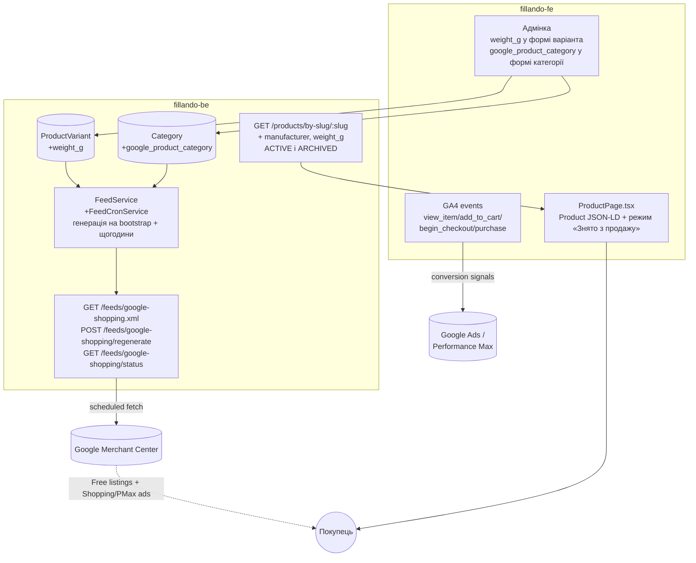

# TD-0006 — Google Merchant Center: продуктовий фід та збагачені structured data

- **Status:** Approved (2026-09-06)
- **Author:** vvbogdanovih
- **Reviewers:** рецензія 2026-09-06 — [TD-0006-review.md](TD-0006-review.md): блокер Б1, М1–М3, S1–S5 внесені в текст; чотири питання §8 закриті власником
- **Date:** 2026-09-01 (аудит коду); переглянуто 2026-09-06 проти `dev` обох репо
- **Components:** both (fillando-be, fillando-fe)
- **Related:** [Plan-0006](../plans/plan-0006-google-merchant.md) (реалізація) · [Plan-0005 §4, блок E](../plans/plan-0005-catalog-target-state.md) · [Plan-0002 roadmap, Фаза 5](../plans/plan-0002-catalog-seo-roadmap.md) · [TD-0002](TD-0002-catalog-taxonomy-and-landings.md) · [TD-0005](TD-0005-catalog-category-isolation.md) · [FRD §4.3, §5, §18.3, §18.5, §18.6](../requirements/FRD.md)

## 1. Summary

Мета — успіх Fillando в Google Merchant Center: і безкоштовні лістинги
(Shopping tab), і платні Shopping/Performance Max кампанії з першого дня
(рішення власника, 2026-09-01).

Сьогодні єдиний сигнал для Google — Product JSON-LD на сторінці товару.
Аудит коду (2026-09-01) показав: жодного вихідного продуктового фіда не
існує (тільки вхідна синхронізація ціни/стоку з Prom.ua — зворотний
напрямок); наявна structured data має конкретні помилки (`brand`
захардкожений на "Fillando", `availability` ігнорує статус товару);
відсутні дані, потрібні для якісного фіда (вага, GTIN/MPN,
`google_product_category`); є Google Ads conversion pixel, але жодних
GA4-подій для Performance Max.

Цей документ проєктує: новий бекенд-модуль генерації Google Shopping
XML-фіда; мінімальний, обґрунтований набір нових полів даних; виправлення й
збагачення Product JSON-LD; розширення конверсійного трекінгу. Усе
спроєктовано під контракт ізоляції категорій із TD-0005 — жодне рішення не
хардкодить припущення "весь каталог = філамент".

## 2. Goals / Non-goals

**Goals**

- Публічний, актуальний Google Shopping XML-фід, придатний і для
  безкоштовних лістингів, і для платних Shopping/PMax кампаній
  (custom labels для сегментації кампаній).
- Виправити наявні помилки в Product JSON-LD (`brand`, `availability`,
  відсутні `sku`/`itemCondition`/`offers.url`/`priceValidUntil`) — вони
  підривають довіру Google і до фіда, і до сторінки.
- Дати Performance Max повний набір конверсійних сигналів (GA4 events), не
  тільки один conversion pixel — малий обсяг продажів робить PMax особливо
  залежним від допоміжних сигналів (`add_to_cart`, `begin_checkout`).
- Кожне нове per-category налаштування (`google_product_category`) живе на
  документі `Category`, за контрактом TD-0005 — ніякого глобального
  припущення чи спільної таблиці, keyed якось інакше.

**Non-goals**

- Content API for Shopping (push через OAuth2/service account) — інфраструктури
  немає (жодна наявна інтеграція — Prom, LiqPay, MonoPay, Nova Post — не
  використовує OAuth2/service account), і немає потреби, яку статичний
  фід не покриває (§6).
- `gtin`/`mpn` як обов'язкові поля — філамент сьогодні не штрихкодований;
  фід і так підтримує `identifier_exists: false`, валідний і не штрафований
  Google-ом стан.
- `condition` як поле в БД — завжди `'new'`, немає жодного flow для
  вживаних/повернених товарів; хардкод у білдері фіда.
- Таксономія/фід для "Аксесуарів" чи інших майбутніх категорій — окрема
  робота, коли Фаза 4 дасть реальний асортимент.
- Enforcement `Category.required_attributes` (зробити обов'язковим на
  запис) — фід дає видимість прогалин через звіт, не через блокування
  запису; окреме рішення, якщо колись знадобиться.

## 3. Background & context

### 3.1 Що вже є (аудит 2026-09-01)

Product JSON-LD, єдина точка генерації — `fillando-fe/src/app/(root)/products/[slug]/ProductPage.tsx:201-219`
(на 2026-09-06; у першій редакції TD стояло `:142-158`):

```js
image: images,                                  // сирі S3-URL, не деривативи
brand: { '@type': 'Brand', name: SITE_NAME },   // завжди "Fillando"
offers: {
  price: variant.price, priceCurrency: 'UAH',
  availability: availableStock > 0 ? 'InStock' : 'OutOfStock',  // тільки stock, ніколи status
  shippingDetails: OFFER_SHIPPING_DETAILS,   // фіксовані ₴97, будь-яка вага
  hasMerchantReturnPolicy: MERCHANT_RETURN_POLICY
}
```

`OFFER_SHIPPING_DETAILS` / `MERCHANT_RETURN_POLICY` — статичні константи,
`fillando-fe/src/common/constants/seo.constants.ts:8-48`, вже узгоджені з
текстом `/returns` (14 днів, зворотну пересилку оплачує покупець за товар
належної якості) — окрім одного нюансу: `/returns` §3 описує ще
proportional-refund/replacement для дефектного товару, якого немає в
статичній константі (див. §5.4).

Google Ads tracking — вже працює: `Analytics.tsx` (consent-gated),
`gtag.ts` (helper, завжди через `dataLayer`, ніколи `window.gtag()`
напряму — це правило вже задокументоване в CLAUDE.md фронтенду), один
conversion event на сторінці успіху чекауту. **Жодного GA4-тега і жодних
ecommerce-подій немає.**

### 3.2 Дані сьогодні (backend)

`ProductVariant`: `product_id, category_id, name, slug, sku, price, stock,
images[], v_value, vendor_product_sku?, prom_id?, prom_base_price,
prom_discount_ratio, prom_discount_seen_at, price_updated_at,
stock_updated_at, status (DRAFT|ACTIVE|ARCHIVED)`.

Підтверджено відсутні будь-де в коді: `weight`/`dimensions`, `gtin`,
`mpn`, `condition`, явне поле `currency` (увесь каталог мовчки припускає
UAH), `diameter` як реальне поле.

`Vendor`: лише `name` (unique) + `slug` (unique). **Це постачальник, не
виробник** (рецензія, Б1): на деві в колекції рівно два документи —
«Filando» (сам магазин) і «NicePrice» (постачальник із мертвої інтеграції,
через яку існує `vendor_product_sku`). Бренд лежить в атрибуті товару
«Виробник» і на деві заповнений на всіх 301 варіанті (Kingroon 181,
Bambu Lab 77, Sunlu 43). Читається наявним хелпером
`pickAttr(attributes, MANUFACTURER_PATTERNS)`
(`product-attribute.helpers.ts:11`), який уже в проді живить колонку бренду
прайс-листа (`price-list/price-list.service.ts:130`) і поле `manufacturer`
прайс-шита (`product.service.ts:185`). **Саме це — джерело `brand`**, не
`Vendor.name`. Чи `Vendor` задуманий як постачальник назавжди — питання до
власника (§8), на дизайн не впливає.

Після Plan-0004 (у `dev` з 2026-09-04) варіант має також `color_id` /
`color_family`, а товар — `spooled_product_id`; колекції `colors` і
`landings` існують. На висновки цього TD це впливає лише в §5.3
(`g:color`, `g:product_type` підключаються одразу, не «пізніше»).

`Category`: `name, slug, required_attributes[], image, order` — жодного
поля під Google-таксономію.

**`vendor_product_sku` — НЕ манфактурний код (MPN).** Перевірено
безпосередньо: `src/docs/DATA_MODELS.md:228` документує його як "external
SKU used to fetch stock from NicePrice" (мертва, ніде не підключена
інтеграція, `niceprice.service.ts`) — це чужий код звірки з постачальником,
не номер деталі виробника. Використовувати його як `mpn` означало б
публікувати в Google Merchant дані, що можуть розійтися з реальним MPN і
дати прапорець розбіжності ідентифікаторів. **Рішення: `mpn` не мапиться
нізвідки сьогодні, лишається відсутнім, як і `gtin`.**

Немає жодного вихідного фіда (Google/Meta/Prom/Rozetka) — підтверджено
порожнім grep по `feed|xml|csv|rss` в усьому `src/`. `PromModule` робить
протилежне: тягне ціну/сток **З** Prom.ua у власні `stock`/`price`, нічого
не публікує назовні. Його структурні патерни (axios-клієнт,
admin-gated SSE, `@nestjs/schedule` cron з `RUN_CRON` і overlap-guard) — це
корисний **структурний** приклад для нового модуля фіда, не пряме
перевикористання (напрямок даних протилежний).

`GET /products/variants/slugs` (джерело sitemap) на момент аудиту не
фільтрував по `status`; виправлено в `dev` разом із `countAll()` (коміт
`0f46afd`, Plan-0003), тож у цього TD роботи тут немає.

`findVariantWithProduct` шукає `{ slug, status: ACTIVE }`
(`product-variant.repository.ts:232`) — DRAFT **і ARCHIVED** віддають 404
на всіх трьох поверхах (репозиторій → `NotFoundException` → `notFound()`).
Це свідома зміна Plan-0003 (той самий коміт), закріплена інтеграційним
тестом і задокументована в `DATA_MODELS.md`, `API_AND_SWAGGER.md`,
`RBAC.md`, `CATALOG_RELEASE.md`. §5.4 частково її відкочує — це названо
там явно.

### 3.3 Категорійна ізоляція (TD-0005)

Будь-яке нове per-category налаштування в цьому TD (`google_product_category`)
живе embedded на документі `Category`, за тим самим патерном, що і
`required_attributes`/`image` — жодної спільної/глобальної таблиці. Фід
читає це поле per-`category_id`, так само, як каталог уже завжди фільтрує
по `category_id` (TD-0005 §5.1).

## 4. Requirements

**Функціональні**

- Публічний XML-фід, що містить тільки `status: ACTIVE` варіанти, з
  коректним `availability` (`in_stock` / `out_of_stock`), правильним
  `brand` (виробник з атрибута, не назва магазину й не постачальник),
  `item_group_id` (групування варіантів одного товару).
- Фід доступний за публічним URL після кожного рестарту без ручного кроку;
  до першої генерації відповідає `503`, ніколи — порожнім каналом.
- Адмін може проставити й виправити `weight_g` варіанта і
  `google_product_category` категорії через форми адмінки (макет, екран 12),
  не лише через API.
- Фід і Product JSON-LD використовують ту саму логіку `availability`/
  `condition`/`weight` — Google не повинен бачити розбіжність між фідом і
  сторінкою (типова причина відхилення в Merchant).
- `google_product_category` — per-category, необов'язкове (не блокує запуск
  для категорії, де ще не встановлено).
- Performance Max отримує щонайменше: `add_to_cart`, `begin_checkout`,
  `purchase` (агреговано) на додачу до наявного Ads conversion pixel.

**Нефункціональні**

- Жодних нових `$lookup`/індексів на гарячому шляху каталогу — фід working
  set будується окремим, нечастим (щогодинним) job, не зачіпає
  `findCatalogItems`.
- Деградація без помилок: категорія/товар без вагового поля, кольору чи
  google_product_category просто не отримує відповідне поле у фіді/JSON-LD
  — ніколи не падає і не блокує решту рядка/сторінки.
- Дані з обох боків (фід і JSON-LD) деривуються з тих самих правил
  (однакова мапа `status`+`stock` → `availability`), не дубльованої окремо
  логіки, що може розійтися.

## 5. Proposed design

### 5.1 Архітектура



### 5.2 Data model changes

| Поле | Де | Тип | Обґрунтування |
|---|---|---|---|
| `weight_g` | `ProductVariant` | `number \| null`, default `null` | Варіант — це sku, що фізично відвантажується; вага двох розмірів котушки одного товару різна, тому не на `Product`. Грами, не кг — уникає float-помилок і робить одиницю частиною імені поля. Живить: JSON-LD `weight`, обчислювану доставку (замість фіксованих ₴97), `g:shipping_weight` у фіді, ваго-залежні тарифи Merchant shipping settings. **Поверхня адмінки:** поле «Вага, г» у картці варіанта (макет, екран 12). Без нього бекфіл лишився б єдиним способом коли-небудь записати вагу — ні виправити після бекфілу, ні проставити новому товару (рецензія, S4). |
| `google_product_category` | `Category` (embedded, `_id:false`) | `{ id: number, path: string } \| null` | Per-category, за контрактом TD-0005 — нова категорія отримує власне значення без спільної таблиці. `id` — канонічний (стабільний при перейменуваннях таксономії Google), `path` — лише для адміна: українського файла таксономії Google не публікує (`uk-UA` віддає 404, перевірено 2026-09-06). `null` не блокує фід — рядок просто йде без цього поля, з попередженням у звіті. **Поверхня адмінки:** секція «SEO та Google Merchant» у формі категорії (екран 12) — для однієї категорії вистачило б `PATCH`, але екран є в макеті, а макет — визначення готовности. |

**Значення для «Філамент» — рішення власника 2026-09-06:**
`{ id: 499682, path: "Electronics > Print, Copy, Scan & Fax > 3D Printer Accessories" }`.
В опублікованій таксономії (`taxonomy-with-ids.en-US.txt`, 5596 рядків, звірено
2026-09-06) слово `Filament` не зустрічається; до 3D-друку стосуються два вузли —
`499682` (аксесуари, листок) і `6865` (самі принтери). Деталізацію добирає
`g:product_type`.

⚠️ **Артборд «Нові поля у формах» показує `ID = 2496` і шлях
`Hardware > Tools > Milling & Cutting Machines > 3D Printer Filament`.** У реальній
таксономії `2496 = Business & Industrial > Medical`, а такого шляху не існує.
З макета значення не копіювати; артборд виправляється окремо (Plan-0005 §6).

**Свідомо НЕ додається:**

- `gtin`/`mpn` на `ProductVariant` — сьогодні 100% значень були б `null`
  (визначення передчасного поля). Додати як тривіальний one-field PR, коли
  з'явиться перший штрихкодований товар (імовірно — категорія "Аксесуари",
  Фаза 4). Немає технічної вартості чекати: Mongoose не штрафує за пізніше
  додане nullable-поле.
- `condition` — завжди `'new'`; константа в білдері фіда, не поле в БД.
- `currency` — увесь застосунок (ціноутворення, LiqPay/MonoPay, Prom-sync)
  уже мовчки й послідовно припускає UAH; окреме поле дало б лише
  захаращення без користі.
- Enforcement `required_attributes` на запис — ризиковано вмикати заднім
  числом на неперевіреному масиві існючих товарів; замість цього — звіт
  про прогалини від самого фіда (§5.3), без блокування звичайного
  редагування адміном.

### 5.3 Feed generation module (backend)

**Механізм доставки: статичний фід за стабільним публічним URL,
регенерований за розкладом** (як уже працює `sitemap.xml`), НЕ Content API
for Shopping. Причина: Content API вимагає OAuth2/service account —
інфраструктури, якої немає в жодній наявній інтеграції цього бекенду (усі —
простий API-key/Bearer виклик). Апгрейд виправданий тільки при десятках
тисяч SKU або потребі push-оновлень у реальному часі (флеш-розпродажі) —
жодне не актуальне сьогодні.

**Формат: RSS 2.0 XML з `g:`-namespace**, не TSV — самоописовий, природно
підтримує повторювані теги (`additional_image_link`), той самий формат, що
й Bing Merchant Center та Meta Commerce Manager (переносимість без
переробки, якщо колись знадобиться). Два невеликі хендрolled-хелпери
(`xmlEscape`, `cdata`) — без нової npm-залежності, узгоджено з наявним
стилем репо (напр. `generateSlug` теж hand-rolled, не через пакет).

**Файлова структура** (`src/modules/feed/`):

```
feed.module.ts
feed.controller.ts              — 3 endpoints нижче
feed.service.ts                 — оркестрація: вибірка, виключення, кеш XML
feed-cron.service.ts            — @nestjs/schedule, RUN_CRON, щогодини
google-shopping-feed.builder.ts — чисті функції: рядок → <item>, availability/condition mapping, xmlEscape/cdata
product-type.resolver.ts        — ізольована точка апгрейду під лендінги TD-0002 (див. нижче)
feed.types.ts                   — FeedRow, FeedGenerationSummary, ExclusionReason
```

Нова репозиторна вибірка, поруч із наявним `findPriceListRows`
(`product-variant.repository.ts`): `findActiveForFeed()` — `$match
{status: ACTIVE}` → `$lookup products/categories/colors` (усі —
`preserveNullAndEmptyArrays`, захист від висячого посилання) → проєкція
потрібних полів. `vendors` не приєднуються: бренд — атрибут товару (§3.2),
а `Vendor` фіду не потрібен. Без нового індексу — це не гарячий шлях (щогодинний job,
не catalog browse), TD-0002's "без нових $lookup на гарячому шляху"
стосується саме каталогу, не цього.

**Ендпоінти** (`endpoints.constant.ts`):

| Метод | Шлях | Доступ |
|---|---|---|
| `GET` | `/feeds/google-shopping.xml` | публічний, як `sitemap.xml`/`robots.txt` — фід не чутливі дані, Merchant/Bing/Meta всі очікують просто фетчабельний URL. До першої генерації після старту процесу — `503` + `Retry-After: 60`, ніколи не порожній `<channel>` (Key flow нижче) |
| `POST` | `/feeds/google-shopping/regenerate` | ADMIN — синхронний (не SSE, як у Prom: агрегація кількох тисяч рядків не потребує progress stream), повертає `FeedGenerationSummary` |
| `GET` | `/feeds/google-shopping/status` | ADMIN — останній summary без перегенерації |

**Кеш і розклад**: один інстанс `api` без реплік — так є сьогодні і так
планується на Railway (Plan-0005 §4, блок A), тому in-memory кеш у
`FeedService` (`cachedXml`, `lastSummary`, `generatedAt`) — без окремої
DB-колекції під кеш. `FeedCronService` перевикористовує наявний `RUN_CRON`
(його ж докстрінг уже узагальнює: "e.g. Prom sync" — не заводимо другий
подібний прапорець), щогодини, overlap-guard як у `PromSyncService`.
Якщо колись з'являться репліки — кеш переїжджає в один Mongo-документ,
зміна ізольована всередині `FeedService`.

**Key flow: Merchant fetch** (рецензія, S5.1 — на Railway рестарти є нормою,
тому холодний старт — не крайовий випадок, а щоденний):

```mermaid
sequenceDiagram
    participant R as Railway (рестарт)
    participant F as FeedService
    participant G as Google Merchant
    R->>F: onApplicationBootstrap → generate() у фоні, не блокує старт
    G->>F: GET /feeds/google-shopping.xml (кеш порожній)
    F-->>G: 503, Retry-After: 60
    Note over G: fetch failed → повтор за розкладом; позиції НЕ знімаються
    F->>F: generate() завершився → cachedXml, lastSummary
    G->>F: GET /feeds/google-shopping.xml
    F-->>G: 200, application/xml, Last-Modified = generatedAt
    loop щогодини (RUN_CRON)
        F->>F: generate(); при помилці лишається попередній XML + лог
    end
```

Чому `503`, а не порожній канал: порожній валідний фід Merchant трактує як
«усі позиції зникли» і знімає їх; невдалий фетч — як тимчасову помилку, і
позиції живуть ще 30 днів від останнього успішного фетчу. Генерація на
bootstrap стискає вікно `503` до кількох секунд; `POST /regenerate` лишається
ручним запасним варіантом. Невдала регенерація ніколи не затирає останній
вдалий XML.

**Мапінг полів:**

| Feed field | Джерело | Примітка |
|---|---|---|
| `g:id` | `ProductVariant.sku` | унікальний, обов'язковий уже сьогодні |
| `g:item_group_id` | `product_id` | групує варіанти одного товару — саме модель варіантів Google |
| `title` | `ProductVariant.name` | вже `"{product.name} — {v_value}"`. **Анти-вимога:** білдер не додає жодних суфіксів на кшталт «(рефіл)» — назва товару вже містить «Refill (без котушки)» (TD-0002 §5.2.1), тож суфікс дав би дубль |
| `description` | `Product.description.html`, HTML→текст, обрізано до 5000 символів | fallback на `title`, якщо відсутнє — не виключення, а попередження у звіті |
| `link` | `{FRONTEND_URL}/products/{variant.slug}` | збігається з фактичним `canonical` сторінки товару |
| `g:image_link` / `g:additional_image_link` | `images[0]` / `images[1..10]`, **оригінальний URL як збережений** — той самий, що віддає Product JSON-LD (`image: images`) | Не деривативи (рецензія, М2): бекфіл `generate-image-derivatives.js` не прогнаний (`MODE = 'dry-run'`), `NEXT_PUBLIC_USE_IMAGE_DERIVATIVES='false'` у проді, а відсутній дериватив — жорсткий 404. Оригінал існує для кожного зображення за визначенням і знімає розбіжність «фід ↔ сторінка». Перехід на `-1280.webp` — окремим кроком після чистого VERIFY-прогону бекфілу, одночасно у фіді та в JSON-LD |
| `g:availability` | `status` + `stock` | таблиця нижче |
| `g:price` | `"{price.toFixed(2)} UAH"` | без `sale_price` — `price` уже фінальна ціна; `prom_base_price` внутрішня бухгалтерія, ніколи не показана покупцю — видавати її як "було" зі спотворило б реальність |
| `g:brand` | `pickAttr(product.attributes, MANUFACTURER_PATTERNS)` — атрибут «Виробник» | Required для товару без GTIN; `Vendor` — постачальник (§3.2), брати його — та сама помилка, що нинішній «Fillando», лише з іншим рядком. Атрибут відсутній → **виключення** з причиною `missing_brand` (на деві 0 таких); фолбеку на назву магазину немає свідомо |
| `g:google_product_category` | `Category.google_product_category.id` | пропускається (не виключення), якщо не встановлено — репортиться |
| `g:product_type` | `"{Category.name} > {Landing.h1}"`, коли товар матчить закріплені фільтри опублікованого лендінга; інакше `Category.name` | Колекція `landings` уже в `dev` (Plan-0004), тож `product-type.resolver.ts` підключається одразу. **Товар може матчити кілька лендінгів** (PETG Refill → і `/filament/petg`, і `/filament/refill`): обирається найбільш специфічний — найбільше збігів у `filters`, за рівності менший `order` (правило зафіксоване в TD-0002 §5.2.3) |
| `g:condition` | константа `'new'` | |
| `g:identifier_exists` | константа `false` | доки немає gtin/mpn |
| `g:color` | `Color.name_uk` через `color_id` (у `dev` після Plan-0004); фолбек — наявний `pickColor()` для варіантів, які словник не покрив (на деві 2 з 301) | Українська, бо мова фіда — `uk`, і це та сама назва, що бачить покупець на сторінці; розбіжність «фід ↔ сторінка» тут така ж небажана, як у зображеннях |
| `g:material` | атрибут `k === 'polymer'` (TD-0002), фолбек — наявний `pickAttr(MATERIAL_PATTERNS)`, доки міграція таксономії не прогнана на проді | перевикористання, не новий код; після релізу фолбек стає мертвою гілкою — прибрати разом із `material` у `required_attributes` |
| `g:shipping_weight` | `"{weight_g/1000} kg"` | пропускається, якщо `weight_g` відсутнє. Для рефілів (TD-0002 §5.2.1) вага реально менша на вагу котушки (~200–250 г) — саме `weight_g`, а не таксономія, моделює фізику посилки |
| `g:custom_label_0..4` | див. нижче | |

**Availability:**

| `status` | `stock` | Результат |
|---|---|---|
| `DRAFT` / `ARCHIVED` | будь-який | **виключено з фіда повністю** |
| `ACTIVE` | `> 0` | `in_stock` |
| `ACTIVE` | `<= 0` | `out_of_stock` (лишається у фіді — так само, як вітрина сьогодні тримає такі товари видимими, просто відсортованими останніми) |

Значення — з підкресленням, як у чинному довіднику атрибута (`in_stock`,
`out_of_stock`, `preorder`, `backorder`); форма через пробіл у довіднику не
згадується, а `availability` — Required, тобто невалідне значення знімає
позицію, не попереджає (рецензія, S2).

`preorder`/`backorder` — свідомий non-goal: немає жодних даних (дата
відновлення стоку абощо), що обґрунтовували б ці статуси; вигадування
ризикує прапорцем невідповідності політиці Google, гірше, ніж консервативний
`out_of_stock`.

**Custom labels** (усе з наявних даних, нічого нового не рахується, крім
label 4):

| Label | Значення |
|---|---|
| `custom_label_0` | `Category.name` |
| `custom_label_1` | виробник — той самий `pickAttr(MANUFACTURER_PATTERNS)`, що й `g:brand` |
| `custom_label_2` | Глибина залишку: `deep` (`stock` > 10) / `low` (1–10) / `out` (0) |
| `custom_label_3` | Ціновий діапазон: `budget` (<500) / `mid` (500–1500) / `premium` (>1500) |
| `custom_label_4` | Швидкість продажів (bestseller/popular/standard) за 90 днів `PAID`-замовлень — **fast-follow, не блокер запуску** (потребує нового `OrderRepository`-агрегату) |

**Маржі у фіді немає — рішення власника 2026-09-06** (питання 1 §8, дефолт
рецензії). Дві причини, і кожної вистачило б окремо:

- `API_AND_SWAGGER.md:200-202` забороняє публікувати будь-що, з чого виводиться
  маржа (`prom_base_price`, `prom_discount_ratio`, …); правило запінене тестами
  (`SUPPLIER_FIELDS`) і зроблене як security-фікс Plan-0003. Публічний фід із
  бакетом маржі був би винятком із власного правила.
- Формула в першій редакції рахувала не маржу: `prom_base_price` — додисконтна
  ціна постачальника, наша ціна = `(base − discount) + фіксована націнка в ₴`
  (`prom-pricing.ts`), тож на акційних товарах виходило від'ємне число, яке
  мовчки падало в `low`; а за правильної формули націнка 30–120 ₴ на котушку
  400–800 ₴ дає 5–9% для всього каталогу — label не сегментував би нічого
  (рецензія, М3).

Глибина залишку рахується з `stock`, який уже є в рядку, і реально ділить
каталог на кампанії «є що продавати» / «добиваємо» / «тільки ремаркетинг».

**Виключення й звіт**: виключаються `status ≠ ACTIVE`, нуль зображень,
відсутня/`≤0` ціна, відсутній атрибут «Виробник» (`missing_brand`), висяче
посилання на product/category.
**Не** виключається `stock=0` (це `availability`, не виключення — інакше
губиться історія показів товару щоразу, як він закінчується). Звіт —
не JSON-файл на диск (це разова міграційна практика TD-0002, тут же —
рекурентна робота): структурований лог щозапуску (як у `PromSyncService`)
+ той самий `FeedGenerationSummary` у відповіді `POST /regenerate` і
`GET /status`. Звіт включає й "м'які" попередження (відсутній
`google_product_category`, опис, вага, невиконаний `required_attributes`
категорії) — саме тут `required_attributes` отримує видимість без
enforcement на запис.

**Залежність від TD-0002 знята самим часом:** `color_id`, `polymer` і
`landings` уже в `dev` (Plan-0004), тож фід пишеться одразу під нову схему.
Фолбеки (`pickColor`, `MATERIAL_PATTERNS`) лишаються тільки на період між
деплоєм коду й прогоном міграцій на проді — обидва відбуваються в одному
релізі (Plan-0005, блок A), тому це вікно вимірюється хвилинами.

### 5.4 Product JSON-LD (frontend)

Виносимо з `ProductPage.tsx` у чисту функцію
`src/app/(root)/products/[slug]/product-jsonld.utils.ts` —
`buildProductJsonLd(data, displayName)` — об'єкт заріс достатньо, щоб
виправдати винесення (узгоджено з наявним патерном `price.utils.ts` тощо).

**Виправлення:**

- **`brand`** → `product.manufacturer` — нове поле на відповіді
  `GET /products/by-slug/:slug`, обчислене тим самим
  `pickAttr(attributes, MANUFACTURER_PATTERNS)`, що й `g:brand` у фіді
  (§5.3), — одна функція на обох поверхнях, тож розійтися вони не можуть.
  **Без фолбеку на `SITE_NAME`**: коли атрибута немає, `brand` у розмітці
  просто відсутній (schema.org його не вимагає) — назва магазину на місці
  бренду і є нинішня помилка. Те саме поле живить чип «Виробник» над H1
  (макет, екран 3).
- **`availability` + доступність сторінки** — статус тепер справді читається:
  - **DRAFT** → як і сьогодні: `notFound()`, `robots: {index:false, follow:false}`
    — чинна поведінка, писати нічого.
  - **ARCHIVED → 200 + `https://schema.org/Discontinued`** — рішення власника
    2026-09-06 (питання 4 §8). Живий беклінк чи ще не призупинена Shopping/PMax
    реклама можуть вести саме сюди — 404 зламав би посадкову сторінку кампанії,
    і цієї втрати не видно в жодному звіті, доки не подивишся в Ads.
    `ARCHIVED` тут означає «більше не возимо», і schema.org має значення саме
    під цей випадок. Сторінка (макет, екран 5): сірий пілл «Знято з продажу»,
    знебарвлене фото, перекреслена ціна, неактивна кнопка «У кошик», без
    перемикача варіантів на архівний, `robots: {index:false, follow:true}`,
    посилання на категорію/лендінг як вихід. Фід архівні виключає за будь-якої
    відповіді (§5.3), тож суперечності немає.

    **Це передбачає бекенд-крок, і він іде першим** (рецензія, S3): сьогодні
    `findVariantWithProduct` шукає `{ slug, status: ACTIVE }`, тому фронтенд
    архівного варіанта не побачить ніколи. Зміна — пустити `ACTIVE + ARCHIVED`
    в одному `$match`, DRAFT лишити невидимим; `siblings` і
    `spooled_counterpart` лишаються `ACTIVE`-only. Оновити інтеграційний тест
    (`it.each(['draft-slug','archived-slug'])` → лише `draft-slug`) і чотири
    доки, що фіксують заборону (`DATA_MODELS.md:321-323`, `API_AND_SWAGGER.md`,
    `RBAC.md`, `CATALOG_RELEASE.md:74`). Поле `status` уже в
    `PUBLIC_VARIANT_FIELDS` і у фронтовому типі.

    **Що при цьому не відкочується, щоб це було сказано вголос:** коміт
    `0f46afd` (Plan-0003) змішав приховування статусів і приховування
    supplier-полів. Відкат стосується тільки першого. `vendor_product_sku`,
    `prom_id`, `prom_*` лишаються прихованими, `SUPPLIER_FIELDS`-тести не
    чіпаються. Кошик і так відмовляє архівному варіанту (`cart.service.ts:82`,
    409), тож жодного шляху купити знятий товар не з'являється.
  - **ACTIVE + stock≤0** → `OutOfStock` (як і сьогодні). **ACTIVE + stock>0**
    → `InStock`.
- **`sku`** — `variant.sku`, тривіально, дані вже є.
- **`itemCondition`** — константа `https://schema.org/NewCondition` під
  `offers.itemCondition` (не поле в БД — той самий YAGNI, що й на бекенді).
- **`gtin`/`mpn`** — **не додається зараз**, узгоджено з бекендовим
  рішенням не заводити ці поля, доки не з'явиться реальний штрихкод.
- **`offers.url`** — `{SITE_URL}/products/{slug}`, збігається з canonical.
- **`offers.priceValidUntil`** — рухоме вікно (`+90` днів від дати
  генерації), а не фіксована дата — безпечно під будь-яким кешуванням
  сторінки.
- **`inProductGroupWithID`** — `product.id`, тільки коли `siblings.length > 1`
  (той самий поріг, що вже вирішує показ перемикача варіантів у UI) —
  простіший, документований Google-ом механізм для «один URL на варіант»
  замість повної вкладеної `ProductGroup`/`hasVariant`. Значення збігається з
  `g:item_group_id` у фіді. **Саме `inProductGroupWithID`, не
  `productGroupID`** (рецензія, М1): у schema.org `productGroupID` має в
  домені лише тип `ProductGroup`; на вузлі `Product` він ігнорується мовчки —
  без помилки в Rich Results Test, без рядка в логах, просто група не
  збирається.
- **`color`/`material`/`weight`** — деградують за конструкцією, не через
  спеціальний прапорець: `color` тільки коли є резолвлений об'єкт кольору з
  бекенду (не відтворюємо на фронтенді color-эвристику, яку TD-0002 якраз
  прибирає з бекенду — інакше повертаємо ту саму крихкість регексом);
  `material` тільки коли існує атрибут `k === 'polymer'`; `weight` тільки
  коли `weight_g != null`. Жодна умова не специфічна для філаменту — код
  для майбутньої категорії без цих концепцій просто ніколи їх не покаже,
  без помилки чи заглушки (пряме виконання контракту TD-0005).
- **`shippingDetails`** — обчислюється з `weight_g` через таблицю ставок
  **дві сходинки × дві зони** (рішення власника 2026-09-06, питання 2 §8):
  «до 2 кг» / «до 10 кг» × «по місту» / «по Україні». Це форма публічного
  тарифу «Стандарт» відділення–відділення Нової Пошти: сходинки, не
  кілограми, і зона як друга вісь. Шість ваг-плейсхолдерів першої редакції
  прибрано.

  **Числа знімаються разовим скриптом із NP API**, не вгадуються: бекенд уже
  має ключ і клієнт (`nova-post-sync.service.ts:186-192`), метод
  `InternetDocument.getDocumentPrice` для 2 ваг × 2 напрямків дає ставки за
  реальним договором магазину — ~20 рядків, без нових залежностей. Результат
  скрипта — один JSON, який іде **в три місця з одного джерела** (рецензія,
  S5.3): константа `SHIPPING_RATE_TABLE` у фронтенді (JSON-LD і блок доставки
  на сторінці товару), account-level shipping у Merchant Center (§9), і в
  `MERCHANT_FEED.md` як запис «звідки числа й коли знімати наново». Хто кого
  оновлює: скрипт → таблиця → адмін переносить у Merchant руками; редагувати
  константу вручну не можна.

  Що виражається і що ні: JSON-LD і сторінка товару користуються зоною «по
  Україні» (`shippingDestination: UA`) — конфігурація покупця на сторінці
  товару невідома, а Merchant так само працює на рівні країни. Зона «по
  місту» лишається в таблиці, бо скрипт її дістає задарма, і знадобиться
  чекауту, коли той знатиме місто — це поза цим TD. Збір за оголошену вартість
  залежить від суми чека, не від ваги, і вагова таблиця його не виражає в
  принципі — на сторінці товару це «орієнтовно», і так підписано (макет,
  екран 3). Товар без `weight_g` → `shippingDetails` відсутній, не «₴97 за
  замовчуванням». Тарифного API в рантаймі немає (YAGNI): таблиця оновлюється
  скриптом, коли змінюється договір.
- **`hasMerchantReturnPolicy`** — додається `itemDefectReturnFees:
  https://schema.org/FreeReturn` (schema.org-поле саме під випадок
  дефектного товару з `/returns` §5, де пересилку оплачує продавець, на
  відміну від стандартного випадку). "Заміна АБО пропорційне повернення
  АБО повний рефанд" (`/returns` §3) свідомо не моделюється —
  `refundType` schema.org не має "пропорційного" значення, а `FullRefund`
  лишається правдивим описом одного з трьох законних варіантів.

### 5.5 Conversion tracking — GA4 (frontend)

**Рішення: додати повноцінну GA4-властивість**, не намагатися видушити
більше сигналу з самого лише Ads. Вартість — майже нульова (той самий
`Analytics.tsx`, той самий consent-гейт, ще один `gtag('config', 'G-XXX')`
поруч із наявним). Для Performance Max при малому обсязі продажів
`purchase`-сигналу замало для Smart Bidding — `add_to_cart`/
`begin_checkout` як допоміжні сигнали (і аудиторії ремаркетингу через
зв'язку Ads↔GA4) — це саме те, що Google рекомендує при низькому обсязі
конверсій. Замінити нічого не потрібно — наявний Ads conversion pixel
лишається як є, GA4 — додатково.

Новий `GOOGLE_ANALYTICS_ID` (env, без хардкодженого фолбеку — на відміну
від Ads, реального значення поки нема, код просто не активується, доки
власник не створить property).

Новий тонкий модуль `src/common/lib/ga4-events.ts` — типізовані обгортки
над наявним `gtag()`, не новий механізм трекінгу:
`trackViewItem`/`trackAddToCart`/`trackBeginCheckout`/`trackPurchase`.

Точки виклику (усі — існючі компоненти, existing hooks/handlers):

| Подія | Де | Коли |
|---|---|---|
| `view_item` | `ProductPage.tsx` | новий `useEffect`, keyed на `variant.id` (не тільки mount — перемикання варіанта через dropdown не ремаунтить компонент) |
| `add_to_cart` | `ProductPage.tsx`, `handleAddToCart` | одразу після успішного `addItem()` |
| `begin_checkout` | `CheckoutPage.tsx` | один раз за відвідування чекауту, з `displayItems`/`total` |
| `purchase` | `CheckoutSuccessContent.tsx` | поруч із наявним Ads conversion event |

`purchase` — **свідомо агрегований, без `items[]`**: сторінка успіху
досяжна і через параметризований редирект (готівка/накладений
платіж/переказ), і через LiqPay-редирект, який конструює бекенд — немає
єдиного способу дотягнути товарні рядки в обох напрямках без додаткового
бекендового lookup-ендпоінта; кошик до того ж уже очищений
(`clearAfterOrder()`) до будь-якого з редиректів. Агрегована `value`/
`currency`/`transaction_id` — усе одно найважливіший сигнал для
value-based bidding у PMax; товарна деталізація — можливий наступний крок,
не зараз.

**Build-args**: `NEXT_PUBLIC_GOOGLE_ADS_ID` і
`NEXT_PUBLIC_GOOGLE_ADS_PURCHASE_CONVERSION` уже прокинуті в
`docker-compose.prod.yml:17-18` (перша редакція TD стверджувала зворотне —
рецензія, S1). Лишається додати два нові — `NEXT_PUBLIC_GOOGLE_ANALYTICS_ID` і
`NEXT_PUBLIC_GOOGLE_SITE_VERIFICATION` (§5.6) — в `Dockerfile.prod` і
`docker-compose.prod.yml` тим самим патерном. На Railway (Plan-0005, блок A)
це ж відображається як змінні сервісу; переписується разом із рунбуками.

**Подвійний облік конверсій** (рецензія, S5.2): Ads-піксель лишається
**єдиним** джерелом конверсії `purchase` для ставок. GA4-подію `purchase`
**не імпортувати в Ads як конверсію** — інакше кожне замовлення рахується
двічі і Smart Bidding оптимізує під удвічі завищену цінність. Зв'язок GA4↔Ads
потрібен для аудиторій і допоміжних сигналів (`add_to_cart`,
`begin_checkout`), а не для другої `purchase`-конверсії. Це записується в
`MERCHANT_FEED.md` і в крок 15 §9, бо помилка робиться в кабінеті, не в коді.

### 5.6 Search Console verification + sitemap

- `layout.tsx`: `metadata.verification.google = process.env.NEXT_PUBLIC_GOOGLE_SITE_VERIFICATION`
  — Next.js не рендерить тег, якщо значення `undefined`, тож це безпечно
  мерджиться зараз і активується, коли власник пройде верифікацію в Search
  Console.
- `sitemap.ts`: `/contacts`, `/offer`, `/returns`, `/privacy`, `/price-sheet`
  **уже в `staticRoutes`** (`sitemap.ts:62-69`, Plan-0004 PR-3) — роботи немає;
  перша редакція TD планувала їх додати.

## 6. Alternatives considered

**Content API for Shopping замість статичного фіда.** Точніший контроль,
можливість push-оновлень у реальному часі. Відкинуто зараз: жодна наявна
інтеграція не має OAuth2/service-account інфраструктури, а масштаб
каталогу (низькі тисячі SKU) не вимагає real-time push. Апгрейд-шлях
лишається відкритим, якщо каталог чи потреби зростуть.

**TSV замість XML.** Простіший парсинг, але позиційно крихкий (опціональна
колонка зсуває решту) і незручний для повторюваних полів
(`additional_image_link`). XML/RSS — самоописовий і портативний на
Bing/Meta без переробки.

**`vendor_product_sku` як `mpn`.** Розглянуто й відкинуто — це код звірки
з мертвою інтеграцією NicePrice, не номер деталі виробника (§3.2).

**Enforcement `required_attributes` зараз.** Відкинуто — ризик заблокувати
звичайне редагування адміном на неперевіреному масиві старих товарів;
замість цього видимість через звіт фіда (§5.3), enforcement — окреме
рішення, якщо звіт покаже, що проблема реальна й велика.

**Фолбек `brand` на назву магазину, коли атрибут «Виробник» відсутній.**
Відкинуто: це і є нинішня помилка, з якої TD починається; для товару без
GTIN бренд, що не збігається з реальним виробником, — типова підстава
item-level disapproval. Порожнє поле чесніше: у JSON-LD `brand` просто немає,
у фіді позиція виключається з іменованою причиною і потрапляє у звіт.

**Персистити XML фіда в Mongo замість in-memory кешу.** Відкинуто зараз:
генерація на bootstrap стискає вікно холодного старту до секунд, а другого
інстанса немає. Якщо репліки з'являться — це один документ і зміна в межах
`FeedService`.

**Бакет маржі в `custom_label_2`.** Відкинуто власником (§8, питання 1): і
порушує записане правило магазину про supplier-поля, і математично не
сегментує (§5.3). Замінено на глибину залишку.

**Реалізувати color/material-евристику на фронтенді як тимчасовий міст до
TD-0002.** Відкинуто: відтворило б ту саму крихкість (регекс за
регістром/синонімами), яку TD-0002 якраз усуває на бекенді. Бекендовий фід
може перевикористати наявний production-хелпер без цього ризику (він уже
є і вже в проді для прайс-листа); фронтенд — ні, тому чекає.

## 7. Cross-cutting concerns

- **Security & privacy**: фід — публічний URL без чутливих персональних
  даних (тільки каталог), як `sitemap.xml`. Жодне supplier-поле
  (`prom_*`, `vendor_product_sku`) і жодна похідна від них у фід не
  потрапляє — правило `API_AND_SWAGGER.md` діє і тут. Розкриття ARCHIVED у
  `by-slug` не розширює набір публічних полів: `PUBLIC_VARIANT_FIELDS` не
  змінюється.
- **Performance & scale**: фід будується окремим, нечастим (щогодинним)
  job, не додає жодного навантаження на гарячий шлях каталогу
  (`findCatalogItems`). In-memory кеш — GET-запит фіда ніколи не тригерить
  агрегацію; до першої генерації після старту — `503`, не блокуючий виклик.
  `findVariantWithProduct` з `ACTIVE + ARCHIVED` — той самий індекс по
  `slug`, без нового.
- **Migration/compatibility**: `weight_g` — нове nullable-поле, без
  міграції-блокера (бекфіл окремо, § Rollout). `google_product_category`
  — нове nullable-embedded поле. Жодних змін до наявних обов'язкових полів.
  Один свідомий відкат поведінки — ARCHIVED-варіант знову читається через
  `by-slug` (§5.4), із оновленням тесту й чотирьох доків.
- **Observability**: `FeedGenerationSummary` (виключення + попередження)
  логується щозапуску і доступний адміну через `GET /status`.
- **Testing strategy**: unit — `google-shopping-feed.builder.ts` (мапінг
  availability з підкресленням, xmlEscape, custom labels, `missing_brand`),
  `product-jsonld.utils.ts` (усі гілки graceful degradation, у т.ч. `brand`
  відсутній, `inProductGroupWithID` лише при `siblings.length > 1`,
  `Discontinued` для ARCHIVED). Integration — `findActiveForFeed` виключає
  DRAFT/ARCHIVED і не тягне supplier-полів; `findVariantWithProduct` віддає
  ARCHIVED і **не** віддає DRAFT. e2e — фід валідний XML, товар з
  `weight_g=null` не ламає жоден рядок, `GET` до першої генерації → 503 з
  `Retry-After`, ARCHIVED-сторінка віддає 200 з `Discontinued` і без кнопки
  купівлі, DRAFT — 404.

## 8. Open questions

Чотири питання першої редакції **закриті власником 2026-09-06** — у кожному
прийнято дефолт, рекомендований рецензією:

| # | Питання | Рішення | Де в тексті |
|---|---|---|---|
| 1 | `custom_label_2` — бакет маржі публічно у фіді? | **Ні.** Замінено на глибину залишку (`deep`/`low`/`out`); правило про supplier-поля лишається без винятків | §5.3 |
| 2 | Вагові діапазони доставки | **Дві сходинки × дві зони**, числа знімаються скриптом із NP API за реальним договором; одна таблиця для JSON-LD, сторінки й Merchant | §5.4 |
| 3 | `google_product_category` для «Філамент» | **`499682` — Electronics > Print, Copy, Scan & Fax > 3D Printer Accessories.** Значення `2496` на артборді — помилка макета | §5.2 |
| 4 | Архівний товар | **200 + `Discontinued`**, з попереднім бекенд-кроком і без відкату security-частини Plan-0003 | §5.4 |

Лишається одне, і воно **не блокує** ні план, ні реалізацію:

1. **Чи `Vendor` — постачальник назавжди**, чи колись мав стати виробником?
   Дизайн бере бренд з атрибута в обох випадках. Якщо колись рішення буде
   «Vendor = виробник», це окрема міграція даних (двом документам зараз
   немає що мігрувати) і окремий TD, бо зачепить адмінку виробників (FRD §12).

## 9. Rollout

Переписано 2026-09-06 після рецензії: кроки на вже зроблене прибрано (S1),
бекенд-крок для ARCHIVED доданий (S3), адмін-UI для нових полів доданий (S4),
`vendor_name` і зміна кошика прибрані (Б1, S5.4). Розбиття на PR-и і статуси —
у [Plan-0006](../plans/plan-0006-google-merchant.md).

| # | Репо | Що |
|---|---|---|
| 1 | be | `ProductVariant.weight_g`, `Category.google_product_category` + DTOs (create/update варіанта й категорії), `yarn spec:export` |
| 2 | be | `findVariantWithProduct`: `status ∈ {ACTIVE, ARCHIVED}`, DRAFT лишається невидимим; `siblings`/`spooled_counterpart` без змін. Оновити int-тест і `DATA_MODELS.md`, `API_AND_SWAGGER.md`, `RBAC.md`, `CATALOG_RELEASE.md`. Supplier-поля не чіпати |
| 3 | be | `manufacturer` (через `pickAttr(MANUFACTURER_PATTERNS)`) + `weight_g` у відповіді `by-slug`. Кошик не змінюється — §5 не проєктує для нього ваги |
| 4 | be | Бекфіл `backfill-variant-weight.js` (dry-run → звіт → apply) — паралельно, не блокер; після нього вага правиться в адмінці (крок 9) |
| 5 | be | Модуль `feed/` повністю: репозиторна вибірка → білдер → контролер → крон → генерація на bootstrap і `503` до неї; реєстрація в `app.module.ts` |
| 6 | be | Скрипт `scripts/shipping-rates.js`: `InternetDocument.getDocumentPrice` для 2 ваг × 2 зон → JSON таблиці ставок; результат — у константу фронтенду (крок 8) і в Merchant (крок 14) |
| 7 | fe | Batch 1 (без залежності від беку): `sku`, `itemCondition`, `offers.url`/`priceValidUntil`, `inProductGroupWithID`, оновлений `hasMerchantReturnPolicy`, verification-хук, GA4-обв'язка (property + 4 події), два нові build-args у `Dockerfile.prod`/`docker-compose.prod.yml`; винесення `buildProductJsonLd` |
| 8 | fe | Batch 2 (після кроків 2, 3, 6): `brand` з `manufacturer` + чип «Виробник» над H1; режим сторінки «Знято з продажу» (екран 5); доставка з `weight_g` за таблицею ставок + блок доставки на сторінці товару (екран 3) |
| 9 | fe | Адмінка (екран 12): поле «Вага, г» у картці варіанта; секція «SEO та Google Merchant» у формі категорії (`id` + `path`, підказка з правильним значенням `499682`) |
| 10 | fe | Batch 3: `color` з `variant.color.name_uk`, `material` з атрибута `polymer` у JSON-LD — дані вже в `by-slug` після Plan-0004 |
| 11 | owner | Через адмінку (крок 9) встановити `google_product_category = 499682` для «Філамент» — не з артборда |
| 12 | be | Fast-follow: `custom_label_4` (`OrderRepository`-агрегат продажів за 90 днів) |
| 13 | owner | Search Console: верифікація сайту, значення в `NEXT_PUBLIC_GOOGLE_SITE_VERIFICATION` |
| 14 | owner | Merchant Center: акаунт, верифікація домену, реєстрація URL фіда, розклад фетчу ≥ щогодини, shipping на рівні акаунта **з таблиці кроку 6**, return-policy |
| 15 | owner | Google Ads ↔ Merchant Center лінк; GA4-property, `NEXT_PUBLIC_GOOGLE_ANALYTICS_ID`; GA4 ↔ Ads лінк **без імпорту GA4 `purchase` як конверсії** (§5.5); запуск Performance Max |
| 16 | be | `src/docs/MERCHANT_FEED.md` (за патерном `PROM_AVAILABILITY_SYNC.md`): формат, виключення, холодний старт, звідки числа доставки, застереження про подвійний облік |
| 17 | both | Оновити FRD (§4.3, §5, §10 і §11 — нові поля форм, §18.3, §18.5, §18.6) після реалізації |

Кроки 11, 13–15 — операційні дії власника в кабінетах Google, поза кодом.
Порядок «код → реліз → міграції → кабінети» лишається: фід не реєструється в
Merchant, доки `dev → prod` не задеплоєно і міграції Plan-0004 не прогнані
(Plan-0005, блок A) — інакше перший фетч Google побачить каталог до
стандартизації кольорів і без лендінгів у `product_type`.
