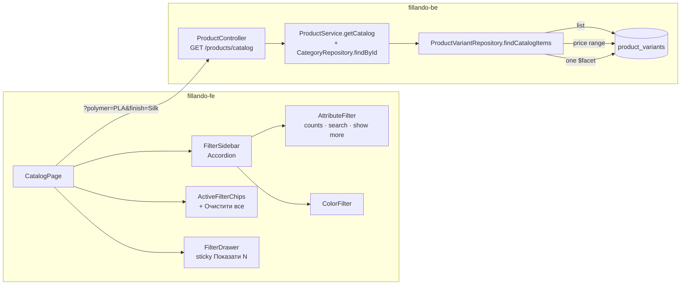
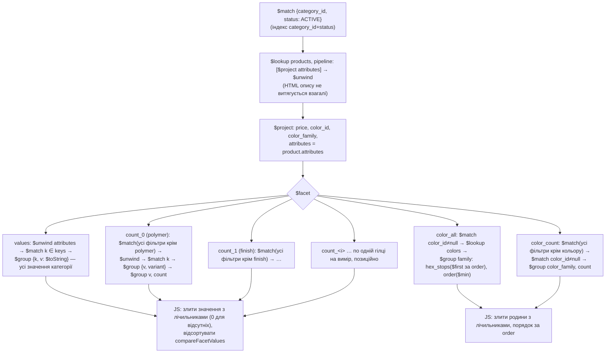

# TD-0008 — Фасети каталогу та UX фільтрів (Фаза 2)

- **Status:** Approved (2026-09-06) — за дефолтами §8, які власник підтвердив рішенням «Фаза 2 лишається»; рецензія — [TD-0008-review.md](TD-0008-review.md): М1–М5 і S1–S6 внесені в текст і в Plan-0007
- **Author:** vvbogdanovih
- **Reviewers:** рецензія-скептик 2026-09-06 (Approve with changes, блокерів немає)
- **Date:** 2026-09-06 (аудит коду проти `dev` обох репо і dev-бази `fillando-dev`)
- **Components:** both (fillando-be, fillando-fe)
- **Related:** [Plan-0002, Фаза 2](../plans/plan-0002-catalog-seo-roadmap.md) · [Plan-0005 §4, блок F](../plans/plan-0005-catalog-target-state.md) · [додаток трекера, §«Категорія /filament»](../plans/plan-0005-appendix-gap-list.md) · [TD-0002 §5.2.1, §5.4](TD-0002-catalog-taxonomy-and-landings.md) · [TD-0005](TD-0005-catalog-category-isolation.md) · [FRD §4](../requirements/FRD.md)

## 1. Summary

Сайдбар категорії сьогодні показує значення фільтрів без лічильників і по всій
категорії, тож після вибору «PLA» покупець не бачить, скільки серед PLA
матових, і не бачить, що «Wood» серед PLA взагалі немає. Лічильник є лише в
кольору. Значення сортуються як рядки, груп не можна згорнути, обране не можна
зняти одним рухом, а на мобілці drawer не каже, скільки товарів дасть
поточний вибір.

Цей документ проєктує: один `$facet`-запит, який рахує кожен вимір категорії з
виключенням власного виміру (стандартний патерн фасетної навігації), числове
сортування значень, нову форму відповіді `GET /products/catalog` і UX сайдбара
(акордеон, пошук у групі, «показати ще», «очистити все», sticky-кнопка в
мобільному drawer). Усе — в межах контракту ізоляції категорій TD-0005 і без
змін у URL та індексації TD-0002 §5.4.

Що робити з range-фільтрами, вирішено за даними dev-бази, а не за макетом:
жоден вимір сьогодні не має числового розкиду, для якого повзунок має сенс
(§3.3, §8 п.2).

## 2. Goals / Non-goals

**Goals**

- Лічильник «(N)» біля кожного значення кожного виміру з `required_attributes`,
  порахований по поточному звуженню з виключенням власного виміру: вибір «PLA»
  не обнуляє решту значень «Тип пластику», але звужує «Ефект поверхні».
- Значення з нулем лишаються в списку (приглушені, клікабельні): список не
  стрибає після кожного кліку, а глибоке посилання чи «назад» на комбінацію
  з нулем показує, чому видача порожня. (SEO тут ні до чого: чекбокси — не
  посилання, а відфільтровані URL і так `noindex`.)
- Колір рахується тим самим правилом, що решта вимірів, а не по всій категорії.
- Числове сортування значень: `1.75` перед `2.85`, `1` перед `3`, `0.5` перед `1`.
- Сайдбар: групи-акордеон, пошук усередині групи при >10 значень, «показати
  ще» після 8, чипи обраного з «Очистити все», sticky «Показати N товарів» у
  drawer на мобілці.
- Вимір з одним значенням у категорії не показується: чекбокс, який нічого не
  відсіює, гірший за відсутній (додаток трекера, рядок про «Котушку»).

**Non-goals** (свідомо поза обсягом)

- Range-фільтри за атрибутами й за `weight_g` — §3.3 і §8 п.2: у даних нема
  чого «повзати». Схема `filter_type: 'range'` лишається; коли з'явиться
  категорія з реальним розкидом, повзунок додається окремим TD.
- Нові виміри, підкатегорії (відхилені двічі), зміни словника кольорів,
  персоналізація порядку значень.
- Зміна параметрів URL, канонікалів, `listingIndexing` — стан акордеона,
  пошуку в групі й «показати ще» живе тільки в UI.
- Приведення типів значень: `attributes[].v` у dev-базі — 100% рядки; матч
  запиту зі збереженим числом (`v: 1.75` ≠ `'1.75'`) — наявна поведінка,
  її не чіпаємо.

## 3. Background & context

### 3.1 Що є в коді (аудит 2026-09-06)

**Бекенд.** `src/database/mongoose/repositories/product-variant.repository.ts`
`findCatalogItems` (:705-925) виконує чотири незалежні агрегати через `Promise.all`:

Рядки — за станом `dev` до PR-1 (після нього файл виріс до ~1000 рядків).

| Пайплайн | Рядки | Що рахує | По чому |
|---|---|---|---|
| `pipeline` (список) | :741-826 | сторінка товарів + `total` | усі активні фільтри |
| `priceRangePipeline` | :828-831 | `min`/`max` ціни | вся категорія |
| `filterOptionsPipeline` | :833-853 | `$addToSet` значень **усіх** ключів `attributes` | вся категорія, без лічильників |
| `colorOptionsPipeline` | :862-899 | `family`, `count`, `hex_stops` | вся категорія |

Наслідки:

- `filterOptionsPipeline` групує **кожен** ключ `product.attributes`, а не лише
  виміри категорії — на dev це 11 ключів, з них `kolir` (23 значення) і
  `material` (30) сайдбар ніколи не показує.
- Значення сортуються `.sort()` за замовчуванням (:913) — лексикографічно.
  `$toString` (:850) потрібен для матчу й лишається.
- Колір уже має `count` (:882), але по категорії: після вибору «Silk»
  swatch «Wood-коричневий» показує число, яке до вибору не стосується.
- `product.service.ts` `getCatalog` (:213-238) розкладає query на резервовані
  ключі (`CATALOG_RESERVED_KEYS`, :630-638) і `attrFilters`; категорію не
  читає, тож не знає, які ключі є вимірами.
- Індекси варіанта (`product-variant.schema.ts:88-94`):
  `{category_id, status}`, `{category_id, status, color_family}`.
- Ізоляцію по категорії пінить
  `product-variant-catalog-isolation.int-spec.ts` — перевіряє
  `filter_options.polymer` і `color_options` (:161-166); новий пайплайн має
  її пройти, а тест — розширитись на нове поле.

**Фронтенд.** `src/app/(root)/[category]/`:

- `CatalogPage.tsx` (399 рядків): URL — єдине джерело стану фільтрів,
  `updateParams` (:114-127) пише в `?query`, ігнорує закріплені лендінгом
  ключі, скидає `page`. Мобільний drawer (:238-262) — власна розмітка,
  без кнопки застосування; фільтри застосовуються миттєво.
- `components/FilterSidebar.tsx` (103): список секцій `divide-y`, порядок —
  ціна, колір, атрибути; секція атрибута рендериться завжди, навіть з одним
  значенням.
- `components/AttributeFilter.tsx` (61): плоский список чекбоксів,
  `filter_type === 'range'` → `null` (нічого не рендериться).
- `components/ActiveFilterChips.tsx` (115): чипи по виміру, чип ціни, замок
  на закріплених; «очистити все» немає.
- `components/ColorFilter.tsx` (98): swatch + `option.count`.
- `components/PriceRangeFilter.tsx` (91): готовий взірець range.
- `catalog.api.ts:82-93` `CatalogResponse`:
  `filter_options: Record<string, string[]>`.
- Другий споживач `filter_options` — адмінка лендінгів,
  `admin/landings/_components/PinnedFilters.tsx:40-56`: бере ключі з
  відповіді як список вимірів, які можна закріпити.
- `common/components/ui/accordion.tsx` — Radix Accordion уже стилізований.

### 3.2 Що обіцяє макет і що — роадмап

Артборд «Категорія /filament» (`Category.dc.html` у полотні) малює сайдбар так:
«Ціна, ₴» (повзунок), «Колір» (swatch-и, рядок «Обрано: Чорний»), далі шість
груп плоскими списками чекбоксів — «Тип пластику», «Ефект поверхні»,
«Армування», «Серія», «Котушка в комплекті», «Виробник». Лічильників біля
значень, згорнутих груп, кнопок «показати ще»/«очистити все» і sticky-кнопки
на артборді **немає**; «Вага» й «Діаметр» у сайдбарі відсутні.

Акордеон, «(24)», пошук у групі, «показати ще», «очистити все» і sticky
«Показати N товарів» — обіцянки Plan-0002 §Фаза 2 (:158-168), перенесені в
додаток трекера рядками 3–5 §«Категорія /filament». Власник 2026-09-06
підтвердив, що блок F лишається в обсязі. Тож проєктуємо об'єднання: візуально
за артбордом (усі групи розкриті, чекбокси), поведінково — за роадмапом
(згортання, лічильники, пошук, «показати ще», чипи, sticky). Відсутність
«Ваги» й «Діаметра» на артборді — не випадковість, а правило: див. §3.3.

### 3.3 Дані dev-бази (read-only аудит 2026-09-06, 301 активний варіант)

`required_attributes` категорії `filament` — 8 вимірів, усі `multi-select`:

| Ключ | Підпис | Значень | Розподіл |
|---|---|---|---|
| `vyrobnyk` | Виробник | 3 | Kingroon 181, Bambu Lab 77, Sunlu 43 |
| `vaha` | Вага, кг | 2 | `1` — 300, `3` — 1 |
| `diametr` | Діаметр, мм | **1** | `1.75` — 301 |
| `polymer` | Тип пластику | 7 | PLA 180, PETG 72, ABS 26, TPU 14, PA6 4, ASA 3, PET 1 |
| `finish` | Ефект поверхні | 10 | Silk 24, Matte 18, Rainbow 15, Tri-Silk 14, Dual-Silk 11, … |
| `reinforcement` | Армування | 2 | CF 13, GF 6 |
| `series` | Серія | 4 | Standard 249, Plus 22, High Speed 21, Lite 8 |
| `spool_included` | Котушка в комплекті | **1** | Так 292 (9 варіантів без значення — рефіл) |

`ProductVariant.weight_g`: три значення — 1220 г (299), 1000 г (1), 3220 г (1).
Ціна: 435–3320 ₴.

Висновки для дизайну:

- **Range безглуздий на всіх осях.** «Діаметр» має одне значення; «Вага» —
  два, і їх уже показує список «1 кг / 3 кг»; `weight_g` має три значення, з
  яких 99% — одне. Повзунок від 1000 до 3220 г із двома товарами на краях
  дублював би атрибут «Вага» й нічого не відсіював би.
- **Вимір з одним значенням треба ховати**, а не рендерити один чекбокс:
  «Діаметр» (завжди) і «Котушка в комплекті» (доки не прогнано
  `split-refill-products` і в базі не з'явиться «Ні (рефіл)»). Правило
  спрацює саме по собі, щойно дані зміняться.
- **Числове сортування потрібне вже** для «Ваги» (`1`, `3`, згодом `0.5`)
  і «Діаметра» (`1.75`, `2.85`), і воно має жити на сервері, щоб порядок був
  один для сайдбара, чипів і адмінки.
- **Лендінги закріплюють лише виміри.** Усі 14 лендінгів dev-бази пінять
  `polymer`, `finish`, `reinforcement`, `spool_included` — жодного ключа поза
  `required_attributes`. Тож звуження `filter_options` до вимірів (§5.3) не
  ламає жодного збереженого лендінга.

## 4. Requirements

**Функціональні** (FRD §4 — каталог і фільтри)

- F1. Для кожного виміру `required_attributes` категорії відповідь містить
  повний список значень категорії з лічильником по поточному звуженню, де
  власний вимір не враховується. Лічильник — «скільки варіантів несуть це
  значення під решту фільтрів», по одному разу на варіант (товар може мати
  два записи `finish`); це не «скільки стане після кліку», бо фільтр у
  вимірі — OR.
- F2. Колір рахується тим самим правилом; родини з нулем не зникають.
- F3. Значення в межах виміру впорядковані: числові за величиною, решта —
  за колатором `uk-UA`; порядок не залежить від людських підписів
  `filter-labels.ts`.
- F4. Сайдбар: групи-акордеон (усі розкриті за замовчуванням), пошук у групі
  при >10 значень, «Показати ще N» після 8, нульові значення приглушені й
  клікабельні, вимір з <2 значень не показується.
- F5. Чипи: «Очистити все» знімає все, що звужує видачу, — кожен параметр
  URL, крім `page`/`limit`/`sort` і закріплених лендінгом (бекенд трактує
  будь-який нерезервований параметр як фільтр, тож `?material=PLA` у
  посиланні теж треба зняти); скидає `page`. Невідомий ключ показується чипом
  із сирим підписом, щоб звуження було видно.
- F6. Drawer на мобілці: sticky-кнопка «Показати N товарів», де N —
  `pagination.total` поточного звуження; та сама цифра, що біля рядка
  «Знайдено». Поки відповідь на новий набір фільтрів не прийшла
  (`isFetching`), кнопка показує «Показати товари» без числа з `aria-busy`, а
  сайдбар тримає попередні фасети (§5.4.3).
- F7. `price_range` лишається по категорії: межі повзунка не «стрибають» після
  кожного кліку (макет малює стабільний діапазон).

**Нефункціональні**

- N1. Агрегатів три (список, ціна, фасети) замість чотирьох; додається одне
  читання категорії за `_id` (індекс, ~1 мс) — воно й дає ключі вимірів.
- N2. Гарячий шлях без нових `$lookup`, крім наявних `products` і `colors`;
  усі гілки `$facet` працюють над одним індексованим `$match {category_id, status}`.
- N3. Ізоляція TD-0005: жодне число у фасетах не рахується поза `category_id`.
- N4. Індексація TD-0002 §5.4 без змін: ті самі параметри URL, той самий
  `listingIndexing`; нічого з UI-стану в адресу не потрапляє.
- N5. Українська локалізація всіх нових написів; множина через `productsCount`.

## 5. Proposed design

### 5.1 Architecture / components



Зміни по репо:

- **be:** `getCatalog` читає категорію й передає в репозиторій ключі вимірів;
  репозиторій замінює `filterOptionsPipeline` + `colorOptionsPipeline` одним
  `$facet`; новий `src/common/utils/facet.utils.ts` (сортування, злиття
  значень із лічильниками); нове поле відповіді `facets`; `filter_options`
  лишається один реліз як похідне; `yarn spec:export`.
- **fe:** `CatalogResponse` доповнюється `facets`; `FilterSidebar` стає
  акордеоном і ховає виміри з <2 значень; `AttributeFilter` отримує
  лічильники, пошук і «показати ще»; `ActiveFilterChips` — «Очистити все»;
  drawer виноситься у `FilterDrawer` зі sticky-кнопкою; адмінський
  `PinnedFilters` переходить на `facets`.

### 5.2 Data model

Схеми не змінюються. `Category.required_attributes[].filter_type: 'range'`
лишається в схемі, але цей TD його не реалізує (§8 п.2) — і на бекенді, і на
фронті вимір із `range` обробляється як список значень, щоб нічого не зникало.

Індексів не додаємо: базовий `$match {category_id, status}` уже покритий
`{category_id: 1, status: 1}`; гілки `$facet` працюють у пам'яті над
результатом цього матчу, індекси всередині гілок Mongo не використовує в
принципі.

### 5.3 API / interfaces

**`GET /products/catalog` — параметри без змін.** `category_id`, `page`,
`limit`, `sort`, `price_min`, `price_max`, `color_family`, `<attrKey>=v1,v2`.
Нових резервованих ключів немає.

**Відповідь — нове поле `facets`, змінений сенс `color_options.count`:**

```jsonc
{
  "items": [ … ],
  "pagination": { "total": 42, … },
  "price_range": { "min": 435, "max": 3320 },      // як і раніше — по категорії
  "facets": {                                       // нове; лише ключі required_attributes
    "polymer": [
      { "value": "PLA",  "count": 24 },             // порахований без власного виміру
      { "value": "PETG", "count": 0 }               // нуль лишається — значення досяжне
    ],
    "vaha": [ { "value": "1", "count": 40 }, { "value": "3", "count": 1 } ]   // числовий порядок
  },
  "color_options": [                                // форма та сама; count — по звуженню
    { "family": "black", "count": 12, "hex_stops": ["#111418"] },
    { "family": "gold",  "count": 0,  "hex_stops": ["#d4af37", "#f3e29a"] }
  ],
  "filter_options": { "polymer": ["PLA", "PETG"], … }   // DEPRECATED: похідне від facets, один реліз
}
```

Правила:

- `facets` містить рівно ключі `required_attributes` категорії, у порядку
  категорії; вимір без жодного значення в товарах — порожній масив (не
  відсутній ключ), щоб фронт не плутав «немає виміру» з «немає даних».
- `count` виміру X = кількість активних варіантів категорії, що проходять усі
  активні фільтри, **крім** фільтра по X (ціна й колір — теж «інші» фільтри).
  Для виміру без активного фільтра це просто поточне звуження.
- `filter_options` будується з `facets` (`values.map(v => v.value)`) — нуль
  додаткових запитів — і живе один реліз. Два сервіси деплояться незалежно
  вже сьогодні (окремі `deploy.yml` на LXC, завтра — Railway), тож між
  деплоями є вікно в обидва боки. Старий фронт на новому бекенді читає
  похідне `filter_options`. Новий фронт на старому бекенді отримує відповідь
  без `facets` — тому фронт має фолбек: будує список із `filter_options` без
  лічильників (§5.4.3), а не ховає всі виміри. Порядок деплою — бекенд
  раніше за фронт (Plan-0005 A2 → A3). Це **поведінкова зміна для адмінки**,
  не лише похідне: `filter_options` звужується з усіх ключів
  `product.attributes` (11 на dev) до вимірів категорії, і `PinnedFilters`
  більше не пропонує закріпити `kolir` чи `material` — так і має бути (сайдбар
  їх не показує), а вже збережений лендінг із таким ключем адмінка й далі
  рендерить із його значеннями (§3.3: на dev таких немає). Видалення
  `filter_options` — окремим PR після приймання (Plan-0007).
- `category_id`, що не є ObjectId, → 400 (до PR-1 було 500 з `new
  Types.ObjectId`); валідний, але невідомий → `facets: {}`,
  `color_options: []`, `items: []`, статус 200. 404 віддає
  `/categories/slug/:slug`, куди сторінка ходить першою.
- Swagger: `API_OPERATION.PRODUCTS.CATALOG.description` доповнюється описом
  `facets`; після змін — `yarn spec:export`.

### 5.4 Key flows

#### 5.4.1 Один `$facet` замість двох агрегатів



«Усі фільтри крім X» будується однією функцією `narrowingMatch(exclude)` з
тих самих `attrFilters`, `colorFamilies`, `price_min/max`, що й список — одне
джерело правди для того, що вважається активним фільтром. Атрибутні умови
після `$lookup` мають форму `{'attributes': {$elemMatch: {k, v: {$in}}}}`
(як у списку, :770-779), ціна — `{price: {$gte, $lte}}`, колір —
`{color_family: {$in}}`.

Список товарів (`pipeline`, :741-826) і `priceRangePipeline` не змінюються:
список і далі матчить колір і ціну до `$lookup`, щоб працював індекс
`{category_id, status, color_family}`.

Три деталі, без яких лічильники брешуть або пайплайн важчає:

- **Один варіант — один голос.** Гілка виміру групує спершу по `{v, variant}`,
  потім по `v`: товар із двома записами `finish` (таксономія пише
  `Silk` + `Rainbow` для «PLA Silk Rainbow») дає варіанту по голосу на кожне
  значення, а дубльований запис одного значення — не подвоює.
- **Імена гілок позиційні** — `count_0`, `count_1`, … за індексом у
  `facetKeys`, тож ключ виміру ніколи не стає ім'ям поля.
- **Пам'ять.** `$lookup` бере з товару лише `attributes` (`pipeline: [{$project}]`),
  тож HTML опису не витягується взагалі; гілки працюють з документами на
  4 поля. Реальне обмеження тут не 100 МБ на стадію, а вихід `$facet` — один
  документ ≤ 16 МБ; для лічильників це десятки КБ. На 5 000 варіантів —
  ~5 000 × ~300 Б на гілку в пам'яті.

#### 5.4.2 Сортування значень (`facet.utils.ts`)

```ts
const NUMERIC = /^-?\d+(\.\d+)?$/
export const compareFacetValues = (a: string, b: string): number => {
	const na = NUMERIC.test(a), nb = NUMERIC.test(b)
	if (na && nb) return parseFloat(a) - parseFloat(b)
	if (na !== nb) return na ? -1 : 1              // числа перед словами
	return UK_COLLATOR.compare(a, b)               // Intl.Collator('uk-UA', { numeric: true, sensitivity: 'base' })
}
```

Рядок з одиницею (`1 кг`) сюди не потрапляє: одиниця живе в
`required_attributes[].unit` і додається на фронті. Лічильник **не** впливає
на порядок — інакше список стрибав би на кожному кліку.

#### 5.4.3 Сайдбар: акордеон, лічильники, пошук, «показати ще»

```mermaid
sequenceDiagram
    actor Buyer
    participant SB as FilterSidebar
    participant CP as CatalogPage
    participant API as GET /products/catalog
    Buyer->>SB: ставить «PLA»
    SB->>CP: onParamsChange({polymer: 'PLA'})
    CP->>CP: URL ?polymer=PLA (page скинуто)
    CP->>API: category_id, polymer=PLA
    API-->>CP: items(42), facets{polymer: PLA 180·PETG 72·…, finish: Silk 10·Matte 8·Wood 0…}, color_options
    CP-->>SB: «Тип пластику» — усі числа по категорії; «Ефект поверхні» — по PLA; Wood (0) приглушений
    Buyer->>SB: відкриває drawer на мобілці
    SB-->>Buyer: sticky «Показати 42 товари» → закриває drawer
```

- **Джерело даних і стан завантаження.** Сьогодні `CatalogPage` передає
  `initialData: initialCatalog` для будь-якого ключа запиту, а ключ містить
  `params` — тож після кожного кліку React Query сідає новий ключ SSR-каталогом
  **без фільтрів** зі статусом `success`: `isLoading` ніколи не `true`,
  сітка, лічильники й число на кнопці на мить показують незвужену категорію
  (рецензія М1). PR-2 виправляє це: `initialData` лише для початкових
  `params` (порівняння з ключем SSR-запиту), `placeholderData: keepPreviousData`
  для решти, стан кнопки й приглушення сайдбара — з `isFetching`. Фолбек
  сумісності: `facets ?? fromFilterOptions(filter_options)` — список без
  лічильників, коли бекенд старіший за фронт (§5.3).
- **Акордеон.** Radix `Accordion type="multiple"`, **керований**: фронт
  тримає набір *згорнутих* груп, а `value` — усі поточні виміри мінус згорнуті,
  тож група, що з'являється після завантаження чи фолбеку, відкрита за
  замовчуванням (некерований `defaultValue` читається один раз при
  монтуванні — рецензія S6.4). Артборд малює все розкритим. Стан не
  персиститься і не пишеться в URL. Тригер групи показує підпис виміру і
  кількість обраних у ньому («· 2»).
- **Видимість групи.** `FilterSidebar` не рендерить вимір, у якого в `facets`
  менше двох значень, і колір, якщо родин менше двох. Це прибирає «Діаметр»
  і — доки не сплитнуто рефіл — «Котушку в комплекті».
- **Список значень.** Перші 8 видимі, далі «Показати ще N» / «Згорнути». При
  >10 значень над списком — поле «Пошук у групі», фільтрує за людським
  підписом (`attributeValueLabel`) і за сирим значенням; обрані значення
  показуються завжди, навіть якщо не проходять пошук чи ліміт 8.
- **Нуль.** `count === 0` → приглушується лише число (`text-muted-foreground`),
  підпис лишається контрастним (WCAG 1.4.3 — `/60` поверх приглушеного
  токена не тримає 4.5:1); чекбокс активний; вибір веде на порожню видачу з
  рядком «Знайдено 0 товарів» — це коректний стан, а не пастка: покупець
  бачить, чому порожньо, і знімає чипом. Скрінрідер читає «(0)» як є.
- **Лічильник** — `(N)` після підпису, як у кольорі (`ColorFilter.tsx:90`);
  `title`/aria — «N товарів із цим значенням», не «показати N» (S1).
- **Range-виміри** (`filter_type: 'range'`) рендеряться тим самим списком, а
  не `null`, як зараз (`AttributeFilter.tsx:59`).

#### 5.4.4 Чипи і «Очистити все»

Кнопка з'являється, щойно є хоча б один чип, який можна зняти. Знімає
**кожен** параметр URL, крім `page`/`limit`/`sort` і закріплених — той самий
набір, що `narrowingKeys` у `CatalogPage.tsx:93-95` — бо бекенд фільтрує за
будь-яким нерезервованим ключем, а не лише за вимірами (S2). Невідомий ключ
(`?material=PLA` з давнього посилання) рендериться чипом із сирим підписом,
щоб звуження не було невидимим. `updateParams` уже скидає `page` і не чіпає
закріплені (`CatalogPage.tsx:117`). На лендінгу після «Очистити все»
лишаються тільки замки.

#### 5.4.5 Drawer на мобілці

Розмітка drawer (`CatalogPage.tsx:238-262`) виноситься у `FilterDrawer.tsx`
з трьома зонами: шапка (заголовок «Фільтри», ✕), прокручуваний контент
(`FilterSidebar` з `idPrefix='mobile-'`), sticky-футер із кнопкою «Показати N
товарів» (`productsCount(pagination.total)`; під час завантаження — «Показати
товари» з `aria-busy`) і другорядним «Очистити» за наявності обраного.
Фільтри застосовуються миттєво, як і зараз: кнопка лише закриває drawer, тож
цифра на ній — це та сама `pagination.total`, що й у рядку «Знайдено» під
сіткою. На лендінгу drawer — єдиний спосіб звузити на всіх ширинах
(`CatalogPage.tsx:211-223`), тож футер потрібен і там.

#### 5.4.6 Лендінг

Закріплені фільтри вже їдуть у запит як параметри (`CatalogPage.tsx:64-67`),
тому фасети автоматично рахуються в межах лендінга; закріплені виміри як і
раніше не потрапляють у сайдбар. Спеціального коду не потрібно.

Наслідок правила «<2 значень по категорії» (S4): на `/filament/tpu` вимір
«Армування» покаже `CF (0)`, `GF (0)` — два приглушені чекбокси. Це свідомо:
правило по категорії стабільне щодо кліків, а два нулі чесно кажуть
«армованого TPU немає». Якщо власник захоче чистіше — ховати вимір, коли всі
значення нульові, жодне не обране й покупець ще нічого не звужував; окремим
рядком у Plan-0007.

## 6. Alternatives considered

- **По одному агрегату на вимір** (N+2 запитів через `Promise.all`).
  Простіше читається, але кожен запит повторює `$match` + `$lookup products`;
  на 8 вимірах — 10 сканів замість одного. Відхилено (N1, N2).
- **Рахувати фасети на фронті з повного списку.** Потребувало б віддавати всі
  варіанти категорії кожним запитом (301 сьогодні, тисячі потім) і зламало б
  пагінацію. Відхилено.
- **Ховати значення з нулем.** Спрощує список, але породжує «стрибучий»
  сайдбар і робить порожню видачу за глибоким посиланням незрозумілою.
  Відхилено; нуль приглушений.
- **Кнопка «Застосувати» в drawer** замість миттєвого застосування. Змінює
  наявну поведінку, потребує локального стану фільтрів і другого джерела правди
  поруч із URL. Відхилено: sticky-кнопка показує число і закриває drawer.
- **Range за `weight_g`** (`weight_min/max`, `weight_range` у відповіді).
  Дешево в коді, але на даних — три значення, 99% одне, і дубль атрибута
  «Вага». Відхилено до появи категорії з реальним розкидом (§8 п.2).
- **Atlas Search `facet`.** Mongo standalone без Atlas Search; відхилено.
- **Змінити форму `filter_options` in place** на `{value, count}[]`. Старий
  фронт у вікні між деплоями впав би на `.length`/`.map` рядків. Відхилено на
  користь нового ключа `facets` + похідного старого на один реліз.

## 7. Cross-cutting concerns

- **Security & privacy.** Публічний GET без змін у доступі. Ключі фасетів
  беруться з категорії, а не з query, а імена гілок `$facet` позиційні
  (`count_<i>`), тож жоден ключ — ні з URL, ні з бази — не стає ім'ям поля.
  Невалідний `category_id` → 400 замість 500.
- **Performance & scale.** Три агрегати на запит (було чотири) плюс
  `findById` категорії. Виміряно 2026-09-06 на dev (301 варіант, 8 вимірів,
  база на віддаленому сервері, RTT ≈ 54 мс): `GET /products/catalog` —
  **avg 285 мс, min 258, max 400** з фільтром `polymer=PLA` і 284/263/434 без
  фільтра; тривіальний `GET /categories/slug/filament` на тому ж каналі —
  60 мс. Тобто на сам каталог припадає ~220 мс, з яких більшість — чотири
  послідовні раунди до бази (категорія → три паралельні агрегати, кожен зі
  своїм `$lookup`) поверх 54 мс RTT, а не обчислення; локально до бази це
  буде десятки мілісекунд. Оцінка на 5 000 варіантів — ~10 гілок × 5 000
  документів по ~300 Б у пам'яті, вихід `$facet` — десятки КБ проти ліміту
  16 МБ на документ. `allowDiskUse` не потрібен.
- **Migration / compatibility.** Міграцій даних немає. Сумісність: `facets`
  додається, `filter_options` лишається один реліз, `color_options` міняє
  лише семантику `count`. Порядок деплою — бекенд, потім фронт; фронт має
  фолбек на `filter_options`, тож зворотний порядок дає сайдбар без
  лічильників, а не порожній. Відкат — revert PR-1: фронт через фолбек
  працює далі.
- **Observability.** Нічого нового; час агрегатів видно в профайлері Mongo,
  гілки — `count_<i>` за порядком `required_attributes`.
- **Testing strategy.**
  - be unit: `facet.utils.spec.ts` — числа перед словами, `0.5 < 1 < 3`,
    `1.75 < 2.85`, український колатор, стабільність при однакових значеннях;
    злиття значень із лічильниками (нуль для відсутніх).
  - be unit: `product.catalog-query.spec.ts` — конструктор із
    `CategoryRepository`; ключі фасетів = `required_attributes.key`;
    невідома категорія → порожні ключі без винятку.
  - be integration: новий `product-variant-catalog-facets.int-spec.ts` —
    (1) лічильник виміру не враховує власний фільтр; (2) фільтр іншого виміру
    звужує лічильники; (3) значення з нулем присутнє; (4) ціна й колір
    звужують атрибутні фасети; (5) `color_options.count` звужується
    атрибутом; (6) порядок `['0.5','1','3']` і порядок ключів = порядок
    `facetKeys`; (7) мультизначний `finish` рахується по разу на значення, а
    дубльований запис не подвоює; (8) чернетка не рахується; (9) вимір без
    даних → `[]`, `filter_options` = `values.map(v => v.value)`. **Переписати**
    `…-isolation.int-spec.ts` (він падає з новим кодом, бо не передає
    `facetKeys`): передавати `facetKeys: ['polymer']`, перевіряти
    `facets.polymer` і `color_options` у межах категорії.
  - fe unit (vitest + RTL): `AttributeFilter.test.tsx` — «(N)», нуль
    приглушений але клікабельний, «Показати ще N» після 8, пошук при >10,
    обране завжди видиме, згорнута група ховає значення;
    `ActiveFilterChips.test.tsx` — «Очистити все» знімає все, крім
    закріпленого, включно з нерезервованим ключем, і не з'являється без
    чипів; чип для виміру, прихованого з сайдбара, якщо URL несе його
    значення; `FilterSidebar.test.tsx` — вимір з одним значенням не
    рендериться, групи розкриті, фолбек без `facets` дає список без
    лічильників; `FilterDrawer.test.tsx` — кнопка несе число, без числа й з
    `aria-busy` під час `isFetching`, закриває drawer; `CatalogPage` —
    `initialData` не застосовується до зміненого набору параметрів.
  - Ручна перевірка на `localhost:9000/filament` і `/filament/pla-silk`
    (§9).

## 8. Open questions

1. **Форма відповіді** — ~~змінювати `filter_options` in place чи додавати
   поле~~. **Дефолт: нове поле `facets`, `filter_options` лишається один
   реліз як похідне, видаляється PR-ом після приймання; фронт має фолбек на
   `filter_options`; деплой бекенда раніше за фронт.** Причина — вікно
   незалежних деплоїв в обидва боки (§5.3). Закрито рецензією.
2. **Range-фільтри** — план сесії пропонував «range лише для ваги за
   `weight_g`». Дані (§3.3) показують три значення ваги з 99% в одному, і
   вимір «Вага» вже є списком. **Дефолт: у цій фазі range не будуємо; схема
   `filter_type: 'range'` лишається; FE рендерить такі виміри списком.**
   Відхилення від дефолту плану — свідоме, з доказами; власник може
   повернути range окремим рядком у Plan-0007, це +1 задача be і +1 fe.
3. **Виміри з одним значенням ховати чи показувати вимкненими?** Дефолт:
   ховати за списком категорії (артборд без «Діаметра», рядок додатка про
   один чекбокс); наслідок для лендінгів — §5.4.6. Закрито рецензією.
4. **Стан акордеона за замовчуванням** — усе розкрито (артборд) чи лише
   групи з обраним (план сесії)? Дефолт: усе розкрито, керований `value`;
   «показати ще» тримає групи короткими. Закрито рецензією.
5. **Порядок «Ні (рефіл)» перед «Так»** у «Котушці в комплекті» — колатор
   ставить їх за алфавітом, артборд малює «Так / Ні (рефіл)». Прийнято як є;
   якщо власник захоче, це `required_attributes[].value_order` окремим TD.

## 9. Rollout

Два PR-и, один реліз, міграцій немає; **бекенд деплоїться раніше за фронт**
(Plan-0005 A2 → A3). Definition of done — екран 1 макета видно покупцю в
проді (Plan-0005 §3), не мерж.

1. **PR-1 (fillando-be)** — `CategoryRepository` у `ProductService`,
   `$facet` у `findCatalogItems`, `facet.utils.ts`, `facets` у відповіді,
   `filter_options` як похідне, Swagger-опис, `yarn spec:export`, юніти й
   інт-тести, `src/docs/CATALOG_FACETS.md`.
2. **PR-2 (fillando-fe)** — `CatalogResponse.facets` + фолбек із
   `filter_options`, `initialData` лише для початкових параметрів +
   `keepPreviousData`, керований акордеон, `AttributeFilter` з
   лічильниками/пошуком/«показати ще», «Очистити все» по всіх звужувальних
   ключах, `FilterDrawer` зі sticky-кнопкою на `isFetching`, приховування
   вимірів з <2 значень, `PinnedFilters` на `facets` зі збереженими ключами,
   тести, `CLAUDE.md` фронта (розділ каталогу).
3. **Після релізу й приймання** — PR-3 (be): видалити `filter_options`;
   FRD §4; Plan-0002 Фаза 2 → Done; Plan-0005 екран 1 і блок F.

Перевірка на dev перед комітом кожного PR:

- be: `curl 'localhost:9001/products/catalog?category_id=<id>&polymer=PLA'` —
  `facets.polymer` містить усі значення з числами по категорії,
  `facets.finish` і `color_options` звужені до PLA, значення з нулем
  присутні; `facets.vaha` у порядку `1, 3`. Виконано 2026-09-06 на dev:
  `polymer` 7/7 значень незмінні, `reinforcement` `CF 13 → 8, GF 6 → 0`,
  `vaha` `3: 1 → 0`. (Конкретні числа — зріз dev-бази, не критерій для
  тестів.)
- fe: `yarn test`, `npx tsc --noEmit`, `yarn build` з піднятим бекендом; на
  `/filament` — акордеон, «(N)», «Показати ще», чипи з «Очистити все», на
  ширині <768 — sticky-кнопка з числом, що дорівнює рядку «Знайдено»; на
  `/filament/pla-silk` — закріплені виміри не в сайдбарі й не знімаються.
