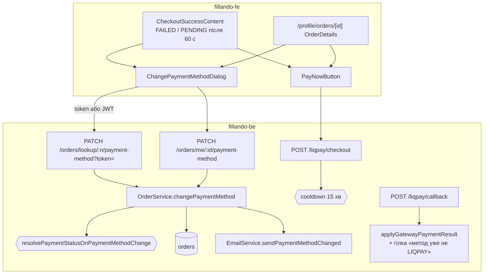
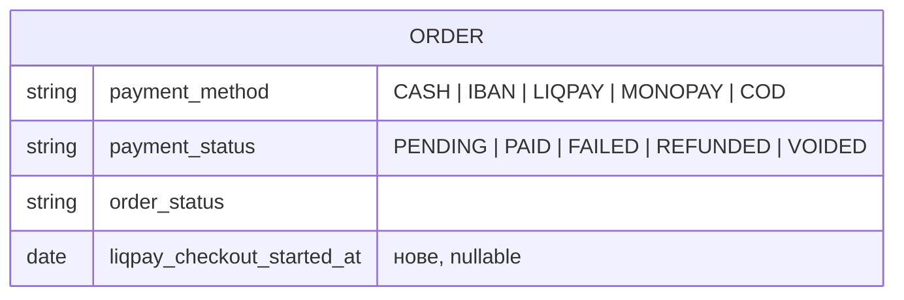
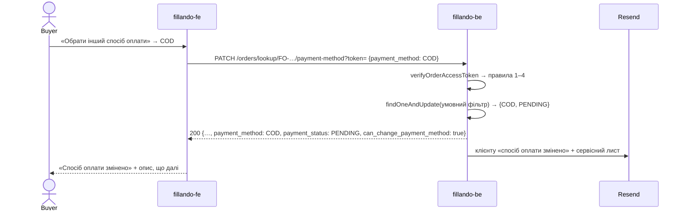
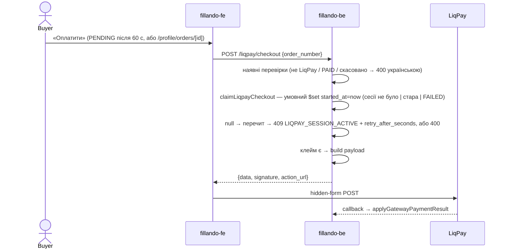

# TD-0009 — Зміна способу оплати клієнтом і доплата LiqPay-замовлення

- **Status:** Approved (2026-09-06) — за дефолтами §8; рецензія — [TD-0009-review.md](TD-0009-review.md): блокер Б1 (атомність cooldown-у й callback-у), М1–М5 і S1–S5 внесені в текст і в PR-1
- **Author:** vvbogdanovih
- **Reviewers:** рецензія-скептик 2026-09-06 (Approve with changes)
- **Date:** 2026-09-06 (аудит коду проти `dev` обох репо)
- **Components:** both (fillando-be, fillando-fe)
- **Related:** [TD-0001](TD-0001-liqpay-integration.md) · [TD-0003](TD-0003-order-cancellation-payment-status.md) · [TD-0004](TD-0004-cash-on-delivery.md) · [state-machines](../architecture/state-machines.md) · [Plan-0005 §3 екран 7, §6 рішення 10](../plans/plan-0005-catalog-target-state.md) · [додаток трекера, рядки 119–122, 222](../plans/plan-0005-appendix-gap-list.md) · FRD §7.1, §7.3, §7.4, §8.2, §8.3

## 1. Summary

Екран «Оплата не пройшла» обіцяє покупцю дві дії — повторити оплату карткою і обрати інший
спосіб оплати — і каже, що товари зарезервовані. Сьогодні працює лише перша: друга кнопка веде
на сторінку контактів, бо публічного шляху змінити `payment_method` створеного замовлення не
існує, а резерву стоку немає взагалі. Замовлення, що застрягло в `PENDING` (наприклад, коли
`POST /liqpay/checkout` впав на чекауті), з інтерфейсу оплатити не можна ні на success-сторінці,
ні в кабінеті.

Власник вирішив 2026-09-06: обіцянку про резерв прибрати з тексту (резерв не будувати), а зміну
способу оплати й доплату `PENDING` — зробити. Цей документ проєктує: два тонкі маршрути на один
сервісний метод зміни способу оплати (публічний за HMAC-токеном і авторизований для кабінету),
чисту функцію статусу оплати з таблицею істинності в стилі TD-0003, правило для пізнього
callback-у LiqPay після зміни методу, захист від другої живої сесії LiqPay одним полем на
замовленні, розширення відповіді `lookup`, листи й фронтові поверхні.

## 2. Goals / Non-goals

**Goals**

- Покупець із FAILED- або PENDING-замовленням LiqPay може сам перевести його на накладний платіж,
  IBAN або готівку (з урахуванням наявного правила сумісності з доставкою) — і з success-сторінки
  (гість, за токеном), і з `/profile/orders/[id]` (за JWT).
- Покупець може оплатити карткою замовлення, що застрягло в PENDING, без ризику двох живих сесій
  LiqPay поверх одного замовлення.
- Пізній callback LiqPay після зміни методу не псує дані: гроші, що прийшли, фіксуються; мертва
  карткова сесія не робить COD-замовлення FAILED.
- Текст екрана «Оплата не пройшла» чесний: замовлення збережено, оплатити можна ще раз.
- Клієнт і сервіс отримують лист про зміну способу оплати.

**Non-goals** (свідомо поза обсягом)

- Резерв стоку (поле hold + TTL) — рішення власника: не будуємо; текст перестає це обіцяти.
- LIQPAY як ціль зміни: офлайн-замовлення на картку переводить лише адмін через `PATCH /orders/:id`.
- Історія змін замовлення / аудит — колекції немає; сліди лише `updatedAt`, сервісний лист,
  `liqpay_checkout_started_at`, лог. Записано в §8.
- Реквізити в IBAN-листі — сьогодні лист каже «реквізити прийдуть після підтвердження», модуль
  `payment-details` лише адмінський; преіснуюче, не чіпаємо (§8).
- Валідація переходів `order_status` загалом — як і в TD-0003, лишається нереалізованою.

## 3. Background & context

### 3.1 Що є в коді (аудит 2026-09-06, `dev`)

**Модель.** `order.schema.ts:113-135`: `payment_method` (`CASH|IBAN|LIQPAY|MONOPAY|COD`),
`payment_status` (`PENDING|PAID|FAILED|REFUNDED|VOIDED`, default PENDING), `order_status`
(default NEW), `payment_transaction_id`; полів LiqPay-сесії немає; токен доступу не
зберігається. Сток лише перевіряється при створенні (`buildOrderItems`,
`order.service.ts:178-190`, 409 `INSUFFICIENT_STOCK`), ніколи не списується й не резервується.

**Публічний lookup.** `GET /orders/lookup/:orderNumber?token=` (`order.controller.ts:95-105`,
`ThrottlerGuard` 30/хв) → `getPaymentStatusPublic` (`order.service.ts:432-447`): HMAC-токен без
стану (`crypto.util.ts:81-104`: `hex(HMAC-SHA256(key, 'order-lookup:' + n)).slice(0,32)`,
`timingSafeEqual`), хибний токен → 404 з тим самим повідомленням, що й відсутнє замовлення;
відповідь рівно `{order_number, payment_method, payment_status, total_price}`.

**Зміна способу оплати** — лише адмінська: `PATCH /orders/:id` → `update()` (:464-473) з
`validatePaymentDeliveryCombination` (:130-140); `ALLOWED_DELIVERY_BY_PAYMENT` (:44-48)
обмежує **лише COD** (NOVA_POST/COURIER). Правило «CASH лише PICKUP» живе тільки в zod-схемі
чекауту фронта (FRD §7.1) — сервер його не перевіряє.

**Листи при створенні.** `create()` (:310-375) шле `sendOrderIbanConfirmation` /
`…Cash…` / `…Cod…` (`email.service.ts:64, :109, :154`), кожен разом із сервісним листом
«Нове замовлення» (`order-created-service.template.ts`). LIQPAY листа не шле; відповідь
`POST /orders` несе `payment_access_token` (:382). Єдине речення, що залежить від методу, —
вступний `<p>` на рядку 90 кожного шаблону: «Замовлення … успішно створено. Оплата — накладним
платежем…» / «…Оплата готівкою при отриманні» / «…після підтвердження вам прийде емейл з
реквізитами». `buildOrderEmailDetails(order)` (:663-690) уже збирає дані листа з документа.

**LiqPay.** `POST /liqpay/checkout` (`liqpay.controller.ts:14-20`, 10/хв, тіло
`{order_number}`) → `buildCheckout` (`liqpay.service.ts:41-78`): відмовляє не-LiqPay (400),
PAID (400), CANCELLED/VOIDED/REFUNDED (400); **PENDING і FAILED пропускає** — саме так працює
«Повторити оплату карткою» (`liqpay.service.spec.ts:118`). **Захисту від другої живої сесії
немає**: жодного запису на замовленні при ініціалізації. Callback `handleCallback` (:84-145) →
`applyGatewayPaymentResult` (`order.service.ts:589-627`) ідемпотентний на PAID, але **не
дивиться на `payment_method`**: пізній `failure` перевів би вже переключене на COD замовлення у
FAILED, а пізній `success` — у PAID із `payment_method: COD`, і адмін збирав би гроші двічі.

**Репозиторій.** `base.repository.ts:27` `update` = `findOneAndUpdate(filter, data,
{returnDocument:'after'})` — умовний фільтр дає атомний захист стану без транзакцій
(standalone MongoDB, див. [[mongo-standalone-no-transactions]] у пам'яті проєкту).

**Фронтенд.** `checkout/success/CheckoutSuccessContent.tsx`: текст FAILED/VOIDED :92-94 —
«Банк відхилив платіж — кошти не списано. Замовлення збережено, товари зарезервовані: можна
спробувати ще раз або обрати інший спосіб оплати.»; `retryMutation` :179-187 →
`startLiqpayCheckout`; кнопки :291-314 лише у `failed`-вигляді, друга — `<Link
href={UI_URLS.CONTACTS}>`; PENDING :103-111 після 60 с опитування — нейтральна картка без дій
(FRD §7.3: «без кнопки повтору — друга сесія LiqPay поверх живої — шлях до подвійного
списання»). `/profile/orders/[id]/OrderDetails.tsx` картка «Оплата» :180-188 показує метод і
статус, дій немає (FRD §8.2 «Тільки перегляд»). Радіо способів оплати — інлайн у
`CheckoutPage.tsx:950-1106` (RHF, модалка COD). `isPaymentMethodAllowed` — чиста
(`checkout.constants.ts:22-29`). `myOrderSchema` `.passthrough()` уже несе `delivery_method` і
`order_status`. `ui/dialog.tsx`, `useLenisModalLock` — є.

### 3.2 Що обіцяє макет (артборд PayFailed, додаток рядки 118–122, 222)

Дві рівноцінні кнопки — «Повторити оплату карткою» (є) і «Обрати інший спосіб оплати» (веде на
контакти — «фактично це «напишіть менеджеру», а артборд обіцяє дію»); «із екрана статусу завжди
можна доплатити незавершене замовлення» (немає). Рядок 119 — «товари зарезервовані» без
резерву; рішення власника: прибрати з тексту.

## 4. Requirements

**Функціональні** (FRD §7.3, §8.2, §8.3)

- F1. Для замовлення з `payment_status ∈ {PENDING, FAILED}` і `order_status ∈ {NEW, CONFIRMED}`
  покупець може змінити `payment_method` на COD / IBAN / CASH — за токеном lookup (гість) або за
  JWT для власного замовлення.
- F2. Зміна поважає сумісність із доставкою: COD лише NOVA_POST/COURIER, CASH лише PICKUP
  (правило переїжджає на сервер).
- F3. Після зміни `payment_status` стає PENDING (якщо був FAILED); клієнт отримує лист із новим
  способом оплати, сервіс — лист про зміну.
- F4. Повторний запит з тим самим методом — 200 без листа; заблоковані стани → 409 з кодом.
- F5. Покупець може ініціювати оплату LiqPay для PENDING-замовлення з success-сторінки і з
  `/profile/orders/[id]`; друга сесія поверх живої відхиляється з кодом і часом очікування, а
  lookup віддає той самий залишок часу, щоб кнопка була або активною, або з годинником — не
  кнопкою, що гарантовано падає.
- F6. Пізній callback LiqPay після зміни методу: `success` → PAID + метод повертається на LIQPAY +
  сервісний лист; `failure` → без змін.
- F7. Текст екрана «Оплата не пройшла» не обіцяє резерв.
- F8. `lookup` віддає `order_status`, `delivery_method`, `can_change_payment_method` (правила
  станів рахує сервер) і `liqpay_retry_after_seconds` (годинник cooldown-у). Правило сумісності
  з доставкою фронт дублює свідомо — воно вже є в `isPaymentMethodAllowed` для чекауту.

**Нефункціональні**

- N1. Жодних PII у публічній відповіді; токен лишається capability в URL, як і сьогодні (FRD §7.3).
- N2. Публічний запис — троттлінг 5/хв на IP (пише в базу й шле листи).
- N3. Атомність без транзакцій: **кожен** запис, який є захистом, — умовний `findOneAndUpdate`
  з піном на прочитаному стані: зміна методу (пін статусів **і поточного методу**), клейм
  LiqPay-сесії (пін «сесії не було / стара / FAILED»), callback (пін методу LIQPAY). Жодного
  check-then-write.
- N6. Усі повідомлення, які доходять до покупця (400 сумісності з доставкою, 400 `buildCheckout`,
  409), — українською; 409 — структуровані, як `INSUFFICIENT_STOCK`.
- N4. Фронт толерантний до старого бекенда: нові поля lookup — optional у zod.
- N5. Українська локалізація нових написів.

## 5. Proposed design

### 5.1 Architecture / components



Нових модулів немає. Зміни: одне поле в схемі замовлення, два маршрути, один сервісний метод,
одна чиста функція, одна гілка в обробнику callback-у, cooldown у `LiqpayService`, один метод
у `EmailService`, розширений lookup DTO; на фронті — спільна тека компонентів і зміни на двох
сторінках.

### 5.2 Data model



- `liqpay_checkout_started_at: Date | null` (default `null`) — момент останнього **клейму**
  LiqPay-сесії для замовлення. Схема-only, міграції не потрібно (Mongoose default). Адмінська
  зміна `payment_method` через `PATCH /orders/:id` скидає його в `null`, щоб стейлий штамп не
  блокував покупця на 15 хв після повернення замовлення на картку.
- `ALLOWED_DELIVERY_BY_PAYMENT` доповнюється `CASH: [PICKUP]` — правило, яке FRD §7.1 і фронт
  уже стверджують, стає серверним. Наслідок для адмінки: `PATCH /orders/:id` тепер теж відмовить
  CASH на NOVA_POST — це виправлення, а не регресія.

### 5.3 API / interfaces

| Маршрут | Guard | Throttle | Відповідь |
|---|---|---|---|
| `PATCH /orders/lookup/:orderNumber/payment-method?token=` | `ThrottlerGuard`; токен у сервісі (хибний → 404 як lookup) | 5/хв | розширений `OrderPaymentStatusResponseDto` |
| `PATCH /orders/me/:id/payment-method` | `JwtAuthGuard`; власність через `findByIdAndUserId` | — | `mapCustomerOrderResponse` |

Чому два маршрути, а не один: гість має лише токен; залогінений покупець у кабінеті має JWT і
`_id`, а токена не має — щоб дати йому токен, довелося б повертати `orderAccessToken` з
`GET /orders/me/:id`, тобто розширювати capability без потреби. Один сервісний метод, дві тонкі
обгортки.

Тіло: `ChangePaymentMethodDto { payment_method: 'COD' | 'IBAN' | 'CASH' }` (`@IsIn` на
`CUSTOMER_SELECTABLE_PAYMENT_METHODS`; LIQPAY/MONOPAY відхиляються валідатором). `me`-маршрут:
невалідний ObjectId → 404 (не BSON 500); гостьове замовлення (`user_id: null`) через нього
недосяжне — гість міняє метод лише за токеном зі success-сторінки.

Коди 409 — рівно тієї форми, що `INSUFFICIENT_STOCK` (`order.service.ts:182-191`):
`ConflictException({ statusCode: 409, error: 'Conflict', code, message, …поля })`, `message`
українською; фронт читає `details.code` (`http.service.ts:46-50`) і показує власний текст за
кодом, `message` — лише фолбек:

| code | коли |
|---|---|
| `PAYMENT_METHOD_LOCKED` | `payment_status ∉ {PENDING, FAILED}` або `order_status ∉ {NEW, CONFIRMED}`, або умовний запис не зматчив (стан змінився під нами) |
| `LIQPAY_SESSION_ACTIVE` | `POST /liqpay/checkout` для PENDING у межах cooldown; тіло несе `retry_after_seconds` |

**Розширений lookup** (`order-payment-status-response.dto.ts`):

```jsonc
{
  "order_number": "FO-0000123",
  "payment_method": "LIQPAY",
  "payment_status": "FAILED",
  "total_price": 2338.2,
  "order_status": "NEW",                 // нове
  "delivery_method": "NOVA_POST",        // нове — щоб фронт знав, чи доступний COD/CASH
    "can_change_payment_method": true,     // нове — рахує сервер за правилами (2)–(3) §5.4.1
  "liqpay_retry_after_seconds": null     // нове — годинник cooldown-у: null = сесії не було, 0 = можна, n = чекати
}
```

`POST /liqpay/checkout` — контракт той самий; додається 409 `LIQPAY_SESSION_ACTIVE`. Swagger:
`API_OPERATION.ORDERS.*` два записи, `LIQPAY.CHECKOUT` — про PENDING/FAILED і 409; після змін
`yarn spec:export`.

### 5.4 Key flows

#### 5.4.1 Зміна способу оплати

Передумови `changePaymentMethod(order, target)` — саме в цьому порядку:

1. `target === order.payment_method` → 200, нічого не пишемо, листа не шлемо (ідемпотентність:
   подвійний клік — один лист).
2. `payment_status ∉ {PENDING, FAILED}` → 409 `PAYMENT_METHOD_LOCKED` (PAID/REFUNDED/VOIDED).
3. `order_status ∉ {NEW, CONFIRMED}` → 409 `PAYMENT_METHOD_LOCKED` (у PROCESSING посилка може
   вже нести COD-накладну; адмін може й далі через `PATCH /orders/:id`).
4. `validatePaymentDeliveryCombination(target, order.delivery_method)` → 400 з українським
   текстом («Спосіб оплати «Готівка» доступний лише з доставкою: Самовивіз») — його читає
   покупець, не лише адмін.
5. Атомний запис: `update({_id, payment_method: order.payment_method, payment_status: {$in:
   [PENDING, FAILED]}, order_status: {$in: [NEW, CONFIRMED]}}, {$set: {payment_method: target,
   payment_status: next ?? current}})`. Пін **поточного методу** закриває гонку двох вкладок
   (COD у A, IBAN у B): друга не перезаписує першу і не шле другого листа. `null` → один
   перечит: якщо там уже `target` — це no-op правила 1 (інша вкладка виграла), інакше 409
   `PAYMENT_METHOD_LOCKED`.
6. Листи fire-and-forget (як у `create()`): клієнту — шаблон цільового методу з варіантом
   «спосіб оплати змінено»; сервісу — той самий сервісний шаблон із заголовком «Зміна способу
   оплати» і `paymentType: 'Накладний платіж (було: LiqPay)'`.

Чиста функція (поруч із `resolvePaymentStatusOnOrderStatusChange`):

`resolvePaymentStatusOnPaymentMethodChange(current: PaymentStatus): PaymentStatus | null` —
`from`/`to` нічого не вирішують (рядки FAILED збігаються незалежно від методів), тож функція
одноаргументна:

| `current` | Результат | Чому |
|---|---|---|
| FAILED | PENDING | FAILED описує спробу карткою (або ручну позначку адміна); IBAN/COD/CASH просто чекає оплати |
| PENDING | null | уже правильний стан |
| PAID / REFUNDED / VOIDED | не викликається | `canCustomerChangePaymentMethod` відмовив раніше (правило 2) |



#### 5.4.2 Пізній callback LiqPay після зміни методу

Після перевірок PAID і CANCELLED **кожен запис пінить метод**, бо між читанням callback-у і його
записом може встигнути `PATCH …/payment-method` (він дозволений під час живої сесії):

| Callback | Запис | Результат |
|---|---|---|
| failed | `update({_id, payment_method: LIQPAY, payment_status: {$ne: PAID}}, {$set: FAILED})` | `null` (замовлення вже офлайн або PAID) → лог, без запису й листа: мертва карткова сесія не має зробити COD-замовлення FAILED |
| paid, прочитано LIQPAY | той самий пін → `$set: PAID` | збіглось → звичайний paid-лист; `null` → перечит: PAID → дубль callback-у, вихід; інакше метод змінили між читанням і записом → гілка нижче |
| paid, метод ≠ LIQPAY | `update({_id, payment_status: {$ne: PAID}}, {$set: {PAID, payment_method: LIQPAY}})` | гроші прийшли карткою — метод має це відбивати; клієнту paid-лист (він справді заплатив), сервісу — лист «не збирати COD/IBAN» |

Якщо замовлення вже поза `NEW`/`CONFIRMED` (адмін оформив ТТН з накладним платежем, а `success`
прийшов із затримкою 3DS/hold), сервісний лист має тему «ТЕРМІНОВО: … зняти Накладний платіж на
ТТН №…» і заголовок «Зняти накладний платіж: оплату отримано карткою», а лог — `warn`: єдиний
запобіжник від того, що покупець заплатить удруге на пошті, — людина.

Той самий принцип, що в TD-0003 для скасованих: гроші, що прийшли, ніколи не губляться.
«Зворотність» зміни методу — про **дані**, не про листи: покупець отримає «спосіб оплати
змінено на накладний платіж», а потім «оплачено»; це прийнятно і сказано вголос.

#### 5.4.3 Доплата PENDING і cooldown другої сесії



- Cooldown 15 хв (`LIQPAY_SESSION_COOLDOWN_MS` у `helpers/liqpay-session.helpers.ts`). Клейм —
  **один умовний запис до побудови payload**, і він `await`-иться: дві вкладки, що одночасно
  тиснуть «Оплатити», отримують рівно один payload; збій запису не віддає payload (fail closed).
  Умова клейму: метод LIQPAY, статус PENDING/FAILED, не CANCELLED, і (`started_at` порожній ∨
  старший за cooldown ∨ статус FAILED). FAILED означає, що LiqPay сам закрив сесію, тому повтор
  дозволений одразу (поточна поведінка «Повторити оплату карткою» не змінюється).
- `liqpayRetryAfterSeconds(order)` — одна чиста функція для 409 і для lookup: `null` — сесії не
  було (платити можна одразу, без 60-секундного очікування — це головний шлях після падіння
  `POST /liqpay/checkout` на чекауті), `0` — можна, `n` — чекати. Прийнята ціна: покупець, що
  закрив вкладку LiqPay, бачить годинник до 15 хв або міняє спосіб оплати — це дешевше за
  подвійне списання.
- Зміна способу оплати cooldown-ом **не** блокується: вона зворотна за §5.4.2, друга карткова
  сесія — ні.
- На ідемпотентність LiqPay за `order_id` не покладаємось: вона не задокументована ні в TD-0001,
  ні в ADR-0009, ні в коді.

#### 5.4.4 Фронтенд

- Спільна тека `src/common/components/order-payment/` (використовують дві сторінки з різних
  сегментів): `PaymentMethodOptions` (три радіо COD/IBAN/CASH, вимикає недоступні через
  `isPaymentMethodAllowed`, підказки «Доступно тільки при…» як на чекауті, деталі COD інлайн
  приміткою), `ChangePaymentMethodDialog` (Radix `Dialog` + `useLenisModalLock`, тости 400/409),
  `PayNowButton` (`startLiqpayCheckout`; на 409 `LIQPAY_SESSION_ACTIVE` — «Ви вже відкривали
  сторінку оплати. Якщо платіж не завершено, спробуйте знову через N хв або оберіть інший
  спосіб оплати.»). Радіо чекауту **не виносяться**: вони прив'язані до RHF і модалки COD, а
  рефакторинг перевіреного чекауту заради трьох пунктів — зайвий ризик.
- `CheckoutSuccessContent`: текст FAILED → «Банк відхилив платіж — кошти не списано. Замовлення
  збережено: можна оплатити карткою ще раз або обрати інший спосіб оплати.»; PENDING: якщо
  `liqpay_retry_after_seconds === null` — «Оплатити» одразу, без 60-секундного очікування (сесії
  не було, callback-у не буде); якщо `> 0` — кнопка вимкнена з «через N хв», активна «Обрати
  інший спосіб оплати»; інакше після закінчення опитування — обидві дії; у `failed` друга
  кнопка відкриває діалог; гілка `payment_method !== 'LIQPAY'` стоїть **перед** `switch` по
  статусу і ключується на lookup, а не на URL (URL і після зміни каже LIQPAY) → «Спосіб оплати
  змінено» з описом за методом і конверсією purchase один раз; опитування зупиняється, коли
  метод уже не LIQPAY; кнопки сховані при `can_change_payment_method === false`. Помилки 400/409
  показуються власним українським текстом за `code`, `message` — фолбек.
- `OrderDetails` (`/profile/orders/[id]`): у картці «Оплата» при PENDING/FAILED і NEW/CONFIRMED —
  `PayNowButton` (лише LIQPAY) і «Змінити спосіб оплати» → діалог з авторизованим маршрутом;
  після успіху інвалідація `['my-order', id]` і `['my-orders']`. Список `Orders.tsx` — без дій.
- Індексація/URL без змін; токен, як і раніше, не потрапляє в localStorage, cookies чи аналітику.

## 6. Alternatives considered

- **Один публічний маршрут за токеном для обох сторінок.** Кабінет мусив би отримати токен із
  `GET /orders/me/:id` — розширення capability без потреби. Відхилено на користь двох тонких
  маршрутів на один метод.
- **Дозволити LIQPAY як ціль зміни.** Покупець офлайн-замовлення міг би перейти на картку сам;
  але це розкриває `POST /liqpay/checkout` для замовлень, створених як COD/IBAN, і потребує
  окремого правила для передоплати COD. Лишається адмінським.
- **Резерв стоку з TTL** — рішення власника: не будувати (L, окремий TD, cron, облік у
  наявності). Текст стає чесним.
- **Покладатися на ідемпотентність LiqPay за `order_id`** замість cooldown-у. Не
  задокументовано в наших доках; поведінка на боці провайдера може змінитись. Відхилено.
- **Cooldown і для FAILED.** Зламало б наявний «Повторити оплату карткою», який працює одразу
  після відмови банку. Відхилено.
- **Check-then-write для cooldown-у й callback-у** (перевірити, потім записати без умови).
  Просто, але дві вкладки або callback+PATCH у вікні між читанням і записом дають саме те, від
  чого захищаємось (рецензія Б1). Відхилено: усі три записи — умовні.
- **Лишити «Обрати інший спосіб оплати» посиланням на контакти, перейменувавши кнопку.**
  Відповідає коду, не макету; власник обрав дію.

## 7. Cross-cutting concerns

- **Security & privacy.** Публічний PATCH захищений тим самим HMAC-токеном, що й lookup; токен
  тепер дає ще одну дію — перевести замовлення на офлайн-метод; грошей це не рухає, PII не
  розкриває (розширення lookup — лише статус, метод доставки і булеве). Троттлінг 5/хв на IP;
  `X-Internal-Token` bypass як для решти. Редакція `req.query.token` у логах уже є
  (`app.module.ts:41-51`). Авторизований маршрут перевіряє власність через `findByIdAndUserId`
  (404, не 403).
- **Performance & scale.** Один `findOne` + один `findOneAndUpdate` + два листи на зміну; не
  гарячий шлях.
- **Migration / compatibility.** Схема — одне nullable-поле, бекфілу немає. Бекенд деплоїться
  першим; фронт із optional-полями працює і на старому бекенді (кнопки зміни методу тоді просто
  не з'являються, бо `can_change_payment_method` відсутній → трактувати як `false`). Відкат —
  revert PR-1: фронт бачить старий lookup і ховає нові дії.
- **Observability.** `logger.log` на зміну методу (номер, from → to), на проігнорований
  failed-callback; `logger.warn` на paid-callback після зміни методу (адмін має не збирати COD),
  з позначкою стану замовлення, якщо воно вже в обробці. Преіснуюче: `handleCallback` звіряє
  `amount` із `total_price` — якщо адмін змінив склад після того, як покупець пішов платити,
  `success` не зарахується (лог, не з цього TD).
- **Testing strategy.**
    - be unit: `payment-status.helpers.spec.ts` — таблиця §5.4.1 і `canCustomerChangePaymentMethod`;
    `liqpay-session.helpers.spec.ts` — `null`/countdown/`0`/FAILED; `order.service.spec.ts` —
    no-op той самий метод (без листа і запису); FAILED LIQPAY→COD → PENDING + лист, фільтр пінить
    метод; CASH на NOVA_POST → 400 українською (і в `create`, і в адмінському `update`);
    PROCESSING/PAID/VOIDED → 409 `PAYMENT_METHOD_LOCKED`; пін не збігся → перечит: цільовий метод
    уже є → 200 без листа, інакше 409; хибний токен → 404 без звернення до репо; `me` з чужим
    або невалідним id → 404; `applyGatewayPaymentResult`: failed з піном на LIQPAY → на COD
    без запису; paid на COD → PAID + LIQPAY + лист `{inFulfilment:false}`; paid на SHIPPED COD →
    `{inFulfilment:true, ttn}`; гонка «прочитано LIQPAY, пін промахнувся, перечит COD» → другий
    запис і лист; перечит PAID → дубль, без листів. `liqpay.service.spec.ts` — клейм до payload;
    клейм `null` + PENDING у вікні → 409 з `retry_after_seconds`; `null` + PAID → 400 «вже
    оплачено»; `null` без cooldown-у → 400; відмова на простих перевірках не клеймить.
  - be integration: `order-payment-method.int-spec.ts` — пін-фільтр застосовується до
    FAILED-замовлення, промахується на PAID і на PROCESSING, штамп сесії зберігається.
  - fe unit (vitest + RTL): `PaymentMethodOptions` (вимкнені стани за доставкою),
    `ChangePaymentMethodDialog` (submit, тости 400/409), `PayNowButton` (текст 409 із
    хвилинами), `CheckoutSuccessContent` (PENDING після 60 с → дві кнопки; FAILED → друга кнопка
    відкриває діалог; lookup з `COD` → «змінено» + одна конверсія; VOIDED → без кнопок),
    `OrderDetails` (дії за статусом).
  - Ручні LiqPay-сценарії в sandbox — власник (Plan-0005 A5): скасувати на сторінці LiqPay →
    через 60 с дві кнопки, «Оплатити» в межах 15 хв → 409, зміна на COD → лист і кабінет
    показує COD/PENDING; оплатити в sandbox і одразу змінити на IBAN в іншій вкладці → PAID/
    LIQPAY і сервісний лист; адмін скасовує → кнопки зникають.

## 8. Open questions

1. **Тривалість cooldown** — 15 хв. Дефолт: константа `LIQPAY_SESSION_COOLDOWN_MS = 15 * 60_000`;
   змінюється одним рядком; залишок видно покупцю через lookup. Закрито рецензією.
5. **Легасі-замовлення `CASH + NOVA_POST` у проді.** Після серверного правила адмін не зможе
   змінити лише `delivery_method` такого замовлення — доведеться міняти обидва поля одним PATCH.
   Перевірити кількість на релізі (`db.orders.countDocuments({payment_method:'CASH',
   delivery_method:{$ne:'PICKUP'}})`); на dev таких немає за визначенням чекауту.
2. **IBAN-лист без реквізитів** — преіснуюче: шаблон обіцяє «реквізити прийдуть після
   підтвердження», модуль `payment-details` адмінський. Зміна способу на IBAN успадковує це.
   Дефолт: не чіпати в цьому TD; якщо власник захоче реквізити в листі — окрема задача
   (публічне читання активних реквізитів + шаблон).
3. **Історії змін немає.** Дефолт: прийняти; сліди — `updatedAt`, сервісні листи, лог,
   `liqpay_checkout_started_at`. Аудит замовлень — окремий TD, якщо знадобиться.
4. **Чи показувати «Оплатити» у списку `/profile/orders`, а не лише в деталях?** Дефолт: лише в
   деталях — таблиця лишається простою, клік по рядку веде до дій.

## 9. Rollout

Два PR-и по коду і правки доків; **бекенд деплоїться раніше за фронт**. Definition of done — екран
7 макета видно покупцю в проді (Plan-0005 §3), не мерж.

1. **PR-1 (fillando-be)** — поле схеми, `CASH: [PICKUP]`, два маршрути, сервісний метод, чиста
   функція, гілка callback-у, cooldown, листи, розширений lookup DTO, Swagger, `yarn spec:export`,
   юніти й один int-тест, `src/docs/LIQPAY_FLOW.md`, `ORDER_ADMIN_API.md`, `API_AND_SWAGGER.md`,
   `DATA_MODELS.md`.
2. **PR-2 (fillando-fe)** — тека `order-payment/`, зміни `CheckoutSuccessContent` і
   `OrderDetails`, схеми, тести, `docs/checkout-flow.md`, `CLAUDE.md`.
3. **Мета (робоче дерево)** — речення, які цей TD скасовує, і їхня заміна:
   - `state-machines.md:75-82` — додати `FAILED → PENDING | Зміна способу оплати з LiqPay на
     офлайн (клієнт)`; після :105 — крос-машинне правило зміни методу (таблиця §5.4.2);
   - FRD §7.3 рядок PENDING «без кнопки повтору (друга сесія LiqPay поверх живої — шлях до
     подвійного списання)» → «кнопка «Оплатити» за годинником cooldown-у (§5.4.3), «Обрати інший
     спосіб оплати»»; рядок FAILED «поки веде на контакти…» → діалог зміни методу; §7.4 — 5/хв
     для нового PATCH; §7.1 — правило CASH → PICKUP стає серверним; §8.2 «Тільки перегляд
     (клієнт не може редагувати)» → «перегляд; для неоплачених NEW/CONFIRMED — оплата LiqPay і
     зміна способу на COD/IBAN/CASH»; §8.3 «Відповідь — лише {4 поля}» → 8 полів + PATCH;
   - `glossary.md` — «LiqPay session cooldown»;
   - FE `docs/checkout-flow.md:141-146` «Known gap» і `:210-215` «The neutral view has no retry
     button…» → нова поведінка; стан `ORDER_ACCEPTED` (без токена) лишається без кнопок;
   - Plan-0005 екран 7 і рішення 10, додаток рядки 119, 121, 122, 222.
