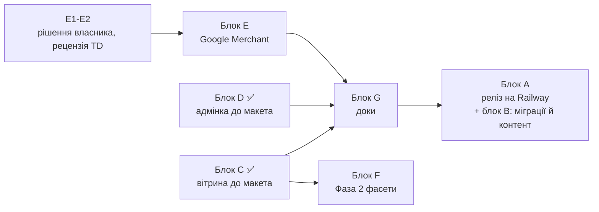

# Plan-0005 — Цільовий стан каталогу: трекер приймання

- **Status:** In Progress — фаза коду майже вичерпана (блоки C, D, E, G6, H1 у `dev` на 2026-09-06, не запушено); деплой винесений в кінець (власник, 2026-09-05), ціль — Railway, гілка `prod`
- **Owner:** vvbogdanovih
- **Date:** 2026-09-05
- **Target:** макет «Оновлений каталог Fillando» повністю в проді
- **Design (TD):** [макет цільового стану](https://claude.ai/code/artifact/d6200740-5fe3-4edc-9461-b4fdf1ad08f0) ·
  [TD-0002](../designs/TD-0002-catalog-taxonomy-and-landings.md) ·
  [TD-0005](../designs/TD-0005-catalog-category-isolation.md) ·
  [TD-0006](../designs/TD-0006-google-merchant-feed-and-structured-data.md)
- **Components:** both (fillando-be, fillando-fe)

---

## 1. Навіщо цей документ

Це не план робіт, а **визначення готовності**. Він існує тому, що звіти про
прогрес почали звучати як фініш: «код змерджено», «гілка мержиться чисто»,
«готові до релізу» — при тому, що покупець не бачить із макета нічого.

Одиниця готовності — не гілка, не PR і не план, а **екран із макета, який
працює в проді на реальних даних**. Доки трекер не зелений, робота не
завершена, і жоден звіт не має права називати її завершеною.

Макет складається з чотирьох джерел змін (артборд «Огляд змін»):

| Джерело | Що приносить | Де спроєктовано |
|---|---|---|
| **TD-0002** | таксономія, словник кольорів, 14 лендінгів, рефіл | TD-0002 → Plan-0004 |
| **Фаза 0** | SEO-гігієна: пагінація, breadcrumbs, сортування, sitemap | Plan-0002 §3 → Plan-0004 |
| **TD-0006** | Google Merchant: фід, вага, бренд, GA4, архівний товар | TD-0006 (Approved 2026-09-06) → [Plan-0006](plan-0006-google-merchant.md) |
| **Аудит** | воронка замовлення + security | Plan-0003 |

---

## 2. Чотири стани, які не можна плутати

| Стан | Значення | Скільки зараз |
|---|---|---|
| `код у dev` | написано й змерджено в `dev`, покупець не бачить | 135 із 212 обіцянок (64%) — на 2026-09-06, за додатком |
| `у проді` | `dev → main` задеплоєно | **0** |
| `дані готові` | міграції прогнані на проді, контент написаний | **0** |
| `видно покупцю` | усе разом; лише це рахується | **0** |

Звірка макета з кодом виконана 2026-09-05: 8 незалежних аудиторів по кластерах
екранів, кожен звіт перевірено окремим скептиком (22 корекції, 35 проґавлених
обіцянок дописано). Розкладка 212 обіцянок: **101 закрито в коді**, 46 зроблено
частково, 36 не розпочато, 29 упираються в дані, а не в код. Сорок один пункт
зрушено після звірки: блок D (адмінка кольорів і лендінгів) і блок C (вітрина).
**Оновлення 2026-09-06:** блок E (Plan-0006), G6, H1 і два пункти чекауту зрушили ще 31
обіцянок; за додатком тепер **135 закрито в коді** (64%), 28 частково, 19 не розпочато,
29 упираються в дані. Не розпочате, що лишилось, — майже все Фаза 2 (блок F) і те, що чекає на
рішення власника (§6). Поіменно — у додатку, з позначкою **код у dev**; там же ті кілька, що зроблені
наполовину свідомо («Показано N з M», плитка зображення без рендера в
«Популярних видах»), і ті, де код готовий, а бракує даних.

---

## 3. Матриця приймання — 14 екранів макета

`%` — частка обіцянок екрана, повністю закритих у коді на `dev`, станом на звірку
2026-09-05; поіменний стан кожного пункту живе в додатку й точніший за це число.
**У проді жоден екран не досягнутий**, бо реліз не робився.

| # | Екран | Код на dev | Головне, чого бракує |
|---|---|---|---|
| 1 | Категорія `/filament` | 36% → див. додаток | плитки, лічильники, чипи над сіткою, 4 колонки, людські підписи фільтрів — у коді (dev). Відкрито: Фаза 2 (акордеон, фасетні лічильники, sticky) — блок F, і дані (міграції, 5 товарів без кольору) |
| 2 | Лендінг `/filament/pla-silk` | 43% → див. додаток | компонування (вступ під H1, дві картки, сітка без сайдбара) і чипи — у коді (dev). Відкрито: **дані** — усі 14 лендінгів досі чернетки без тексту, тож адреси віддають 404 |
| 3 | Сторінка товару | 15% → див. додаток | swatch-перемикач, таблиця характеристик, **чип виробника, блок доставки за вагою, повна JSON-LD (`sku`, `inProductGroupWithID`, `brand`)** — у коді (dev, Plan-0006 PR-1/PR-4/PR-6, 2026-09-06). Відкрито: дані (вага перевірена лише бекфілом; ставки NP зняті 06.09) і реліз |
| 4 | Товар-рефіл | 11% → див. додаток | бейдж, ціна спуленого й посилання — у коді (dev), і парність переживає сплит через `spooled_product_id`. Відкрито: **дані** — сплит і атрибут проставляються міграцією на релізі |
| 5 | Архівний товар | 20% → **код у dev** | `by-slug` віддає 200 зі `status: archived`, сторінка в режимі «Знято з продажу» (пілл, знебарвлене фото, перекреслена ціна, вимкнена кнопка, `noindex,follow`, `Discontinued`) — Plan-0006 задачі 3 і 27, 2026-09-06. У dev-базі архівних варіантів нема — перевірено int- і компонентними тестами |
| 6 | Чекаут: помилки | 38% → **код у dev** | складська помилка тепер 409 `INSUFFICIENT_STOCK` з `variant_id`; на чекауті — під своєю позицією, українською, з червоною сумою й скролом до неї (2026-09-06). Лишилось: підпис «Знижковий купон» / плейсхолдер «Введіть код купона» (зараз «Промокод») — дрібниця формулювань |
| 7 | Оплата не пройшла | 50% → частково | текст з номером дій і хвостом «можна спробувати ще раз або обрати інший спосіб оплати», іконка повтору — у коді (dev, 2026-09-06). Відкрито: «обрати інший спосіб оплати» веде на контакти (зміни способу оплати замовлення немає), «товари зарезервовані» — неправда без резерву стоку; обидва — рішення власника (§6) |
| 8 | Адмінка: кольори | 28% → див. додаток | таблиця з 9 колонок, Slug, Порядок, Варіантів, Name EN і per-stop чипи — у коді (dev). Відкрито: «Показано N з M» (свідомо, поки немає фільтра), пояснювальний абзац і бейджі «нове» (D7), порядок пунктів меню, дані словника |
| 9 | Діалог кольору | 44% → **код у dev** | модалка 512px, підказки, порядок полів, прев'ю (D1, D7); drag-and-drop стопів і українське повідомлення про дубль — 2026-09-06. Відкритого не лишилось |
| 10 | Адмінка: лендінги | 33% → див. додаток | таблиця з колонками «Товарів» і «Контент», людські назви атрибутів у чипах, заборона публікації порожнього лендінга — у коді (dev). Відкрито: «Показано N з M» (свідомо) і дані — тексти 14 лендінгів |
| 11 | Лендінг: редагування | 56% → див. додаток | дві колонки, п'ять секцій, картки «Фільтр N» із парами «Атрибут / Значення», поле зображення плитки — у коді (dev). Відкрито: рендер плитки в «Популярні види» (це C2) |
| 12 | Нові поля у формах | **код у dev** | `weight_g` (схема, DTO, картка й модалка варіанта, колонка в таблиці) і `google_product_category` (схема, DTO, секція «SEO та Google Merchant» з кнопкою «Підставити для філаменту» = `499682`) — Plan-0006 PR-1, PR-5, 2026-09-06. Дані: вага проставлена бекфілом на dev (301/301); на проді — міграцією 3i на релізі. Артборд показував `2496` — виправлено |
| 13 | Статус Google-фіда | **код у dev** | модуль `feed/` (RSS 2.0, генерація на bootstrap + щогодини, 503 до першої генерації), екран `/admin/feed` (статус, KPI, виключення, попередження, «Перегенерувати»), GA4 (4 події) — Plan-0006 PR-2, PR-4, PR-5, 2026-09-06. На dev-сервері: 301 позиція, 0 виключень, бренди Kingroon/Bambu Lab/Sunlu. Відкрито: кабінети Google після релізу (E5) |
| 14 | Огляд змін | 18% | зведення чотирьох блоків; закрито лише те, що закрито нижче |

---

## 4. Блоки залишкової роботи

Кожен блок можна свідомо зняти з обсягу — але знімає **власник**, і тоді пункт
викреслюється з макета. Мовчазне «не зробили, бо дрібниця» тут заборонене.

Порядкові деталі кожного пункту з доказами в коді — у
[додатку](plan-0005-appendix-gap-list.md): усі 111 незакритих обіцянок, згрупованих
за екранами макета.

### Блок A — Реліз (остання фаза)

**Ціль розгортання змінюється: Railway, нова гілка `prod`** (власник, 2026-09-05). Рунбуки
`deploy-backend-lxc.md` і `deploy-frontend-lxc.md` описують поточний LXC і будуть замінені, коли
дійде до цієї фази; тоді ж переписуються GitHub Actions, спосіб запуску міграцій і розділ про
env. Дві речі перевірити на Railway окремо: чи MongoDB там replica set, бо весь ланцюг міграцій
написаний під **відсутність** транзакцій на standalone, і як вирішується питання real-IP для
рейт-лімітера, яке на поточному проді стоїть через Cloudflare.

Процедура кроків і порядок міграцій лишаються чинними незалежно від майданчика —
[`CATALOG_RELEASE.md`](../../repos/fillando-be/src/docs/CATALOG_RELEASE.md), одна команда
`yarn migrate`. Таблиця нижче написана під нинішній LXC і оновиться разом із рунбуками.

| # | Дія | Хто | Блокує |
|---|---|---|---|
| A1 | Перевірити real-IP у Nginx Proxy Manager (прод за Cloudflare — інакше ліміти спільні для всіх) | власник | A2 |
| A2 | `dev → main` fillando-be + перевірки після деплою | власник | усе |
| A3 | `dev → main` fillando-fe + перевірки після деплою | власник | A4, B |
| A4 | Міграції однією командою: `node scripts/migrations/run-catalog-migrations.js --dry-run`, потім без прапорця; крок кольорів окремо через `--colors-only` після A3. Відрепетирувано на дампі прода 2026-09-05, ланцюг проходить і сходиться | власник | Блок B |
| A5 | Ручні LiqPay-сценарії в sandbox (4 штуки) | власник | приймання екрана 7 |

### Блок B — Дані й контент

Код без цих даних не показує нічого нового. Жодна з цих робіт не покрита
задачею в наявних планах — це головна причина, чому «код готовий» ≠ «працює».

| # | Дія | Обсяг | Наслідок, поки не зроблено |
|---|---|---|---|
| B1 | ~~Написати~~ тексти написані (`scripts/fillando_v_2/landing-copy.js`), застосовує їх крок `fill-landing-copy`. **На деві залито й опубліковано 13 із 14** (2026-09-05); `refill` лишається чернеткою, бо матчить 0 товарів до сплиту. На проді повториться під час релізу. Сторінка для рецензії: https://claude.ai/code/artifact/85680548-363b-4021-939b-4bebf26e7621 Лишається: прочитати, виправити й опублікувати по одному | M | усі 14 адрес віддають 404, доки лендінги не опубліковані |
| B2 | ~~Розібрати 49 написань~~ 48 із 49 покриті словником (56 → 103 записи), перевірено на дампі: 83% → **99%**. Лишились два варіанти «Candy», їх розсудить лише людина за фото | S | два варіанти невидимі для swatch-фільтра |
| B3 | ~~Винести рефіл вручну~~ автоматизовано міграцією `split-refill-products.js` (крок 3c). Лишається переписати опис нового товару, він успадкований від батьківського | S | без прогону міграції екран 4 неможливий, `/filament/refill` матчить 0 |
| B4 | ~~Проставити Матеріал вручну~~ автоматизовано міграцією `fix-known-data-defects.js` (крок 3a): матеріал і тип `category_id` виправляються разом | — | закрито |
| B5 | Розвести дублікати «Candy» FL-000157 / FL-000162 | S | товар Kingroon PLA Silk Rainbow неможливо перейменувати (409) |
| B6 | ~~Дубльований `finish`~~ це не дефект даних: багатозначні виміри так і задумані, і лендінги на них спираються. Виправляти треба форму адмінки, див. блок D | — | перенесено в D |
| B7 | Перейменувати товари під короткі назви макета («Sunlu PLA Silk») | L | H1 і картки лишаються довгими SEO-рядками; тягне зміну слагів без 301 |

### Блок C — Довести вітрину до макета

**Блок закритий у коді (`dev`), 2026-09-05.** Десять пунктів із десяти. Покупець
цього ще не бачить: релізу не було, а частина екранів додатково впирається в
дані — тексти 14 лендінгів, прогін міграцій, 5 товарів без кольору.

Три речі варто знати про те, як це зроблено:
- **C1 вирішено в джерелі, а не на кожній поверхні.** Формат «Чорний (Black)»
  тепер зберігається в назві варіанта, тож кошик, замовлення й лист отримують
  його без жодного приєднання словника. Міграція ще не бігала на проді — саме
  тому це зроблено зараз, а не другим проходом по даних.
- **C9 переживає сплит рефілу.** З'явилося поле `Product.spooled_product_id`,
  яке пише сама сплит-міграція. Без нього ціна спуленого варіанта й посилання
  на нього зламалися б рівно тоді, коли міграція відпрацює.
- **Дві обіцянки виконані не буквально** і названі в трекері поіменно: коротка
  назва плитки виводиться з H1 (окремого поля ніхто не проєктував), а таблиця
  характеристик прибирає лише `material` замість строгого allowlist.

| # | Дія | Обсяг |
|---|---|---|
| C1 | ~~Формат «Чорний (Black)» скрізь~~ **код у dev**: вирішено в джерелі — `variantName` і міграція пишуть цю форму в саму назву варіанта, тож кошик, снапшот замовлення й лист успадковують її, нічого не приєднуючи. Прайс уже віддавав окрему колонку; картка каталогу переписує стару збережену форму й кладе в кошик той самий рядок, що й сторінка товару | M |
| C2 | ~~Плитки «Популярні види»~~ **код у dev**: `PopularLandings.tsx` — зображення або стабільна крапка, `product_count` із публічного `GET /landings`, коротка назва, «Ще N видів». Коротка назва виводиться з H1 (мінус хвостова згадка категорії): для 8 із 14 лендінгів дає точно те, що в артборді, решта друкуються цілком. Окреме поле короткої назви ніхто не проєктував | M |
| C3 | ~~Лічильник товарів біля H1 і рядок «Знайдено N за фільтром»~~ **код у dev**; українська множина винесена в одну перевірену функцію, бо в 11–14 останній розряд бреше | S |
| C4 | ~~Чипи активних фільтрів над сіткою~~ **код у dev**: `ActiveFilterChips.tsx`; на мобілці це єдине місце, де закріплені фільтри взагалі видно | M |
| C5 | ~~Swatch-перемикач кольору над кнопкою купівлі~~ **код у dev**: `VariantSwitcher.tsx`; випадайка лишається там, де вісь не кольорова або словник не покрив усі варіанти | M |
| C6 | ~~Курована таблиця характеристик~~ **код у dev**: фіксований порядок, злиття багатозначних вимірів в один рядок, акцент на «Ні (рефіл)». Замість строгого allowlist — прибрано лише `material` (з нього ці виміри й виведені), а нерозпізнані атрибути лишаються: мовчки ховати дані гірше, ніж показати зайвий рядок | M |
| C7 | ~~Людські підписи значень фільтрів~~ **код у dev**: `filter-labels.ts` — одне місце, де це переписати; невідоме значення проходить як є, тож новий матеріал не зникає з фільтра. Формулювання варто вичитати власнику | S |
| C8 | ~~Компонування лендінга~~ **код у dev**; фільтри лендінга лишились досяжні через drawer на будь-якій ширині — без цього чипи могли б лише знімати фільтри, але не додавати | M |
| C9 | ~~Рефіл: бейдж, ціна спуленого, посилання~~ **код у dev**; парність більше не евристика по `v_value`: сплит-міграція пише `Product.spooled_product_id`, `by-slug` віддає `spooled_counterpart` того самого кольору. Сторінка працює і до сплиту (через siblings), і після | M |
| C10 | ~~Сітка в 4 колонки на xl~~ **код у dev** | S |

### Блок D — Довести адмінку до макета

**Блок закритий у коді (`dev`), 2026-09-05.** Сім пунктів із семи; покупця це не
стосується — адмінку бачить лише власник, і до релізу вона лишається на `dev`.
Два пункти макета всередині блоку зроблені наполовину свідомо: «Показано N з M»
(без фільтра завжди «N з N») і плитка зображення (поле є, рендер у «Популярних
видах» — це C2). Обидва названі в додатку.

| # | Дія | Обсяг |
|---|---|---|
| D1 | ~~Кольори: таблиця замість списку; колонки Slug, Порядок, per-stop чипи~~ **код у dev**: картка на всю ширину з таблицею на 9 колонок (`ColorTable.tsx`), Name EN окремою колонкою, per-stop чипи з hex у `title`. Форма кольору переїхала в модалку 512px — окремим пунктом блоку не значилася, але таблиця на всю ширину й бічна панель не співіснують. Свідомо не робив «Показано N з M»: без фільтра це завжди «103 з 103» | M |
| D2 | ~~Колонка «Варіантів» у словнику кольорів~~ **код у dev**: `GET /colors/admin` (ADMIN-only) віддає словник із `variant_count` — один `$group` по `color_id`, що рахує ті самі варіанти, що й guard видалення, тож 0 у колонці завжди означає «можна видаляти». Колонка стоїть праворуч у списку кольорів. Покупця не стосується, але без неї 49 написань розбирали б наосліп | M |
| D3 | ~~Лендінги: колонки «Товарів» і «Контент»~~ **код у dev**: `product_count` у `GET /landings/admin` (один `$facet`, гілка на лендінг), «Контент» — похідне від текстів і FAQ, міряє текст, а не розмітку. Плюс таблиця замість списку — без неї колонок нікуди покласти | M |
| D4 | ~~Лендінги: людські назви атрибутів у чипах~~ **код у dev**: мапа `attrKey → label` із `required_attributes` категорії, спільна для таблиці й для карток фільтрів | S |
| D5 | ~~Форма лендінга: дві колонки, секції, пари «Атрибут / Значення», поле зображення плитки~~ **код у dev**: п'ять секцій у двох колонках, картки «Фільтр N», завантаження плитки через `UploadEntityType.LANDING`. «Значення» лишається мультивибором — у даних є `reinforcement: CF, GF`, чого один випадайок не виражає. Рендер плитки на вітрині — це C2 | M |
| D6 | ~~Заборонити публікацію лендінга з 0 товарів~~ **код у dev**: сервер відповідає 409, перевіряючи стан, який лишить збереження (звуження фільтрів уже опублікованого теж не пройде); форма блокує кнопку раніше за тим самим лічильником | S |
| D7 | ~~Заголовки екранів, пояснювальні абзаци, підказки під полями, бейджі «нове»~~ **код у dev**: бейджі й порядок пунктів у сайдбарі, абзаци над обома таблицями, хінти під полями назв кольору й під текстами лендінга, блок «Прев'ю на сайті» зі slug | S |

### Блок E — Фаза 5: Google Merchant (TD-0006)

**Код блоку закритий у `dev` 2026-09-06 (E1–E4, PR-1…PR-7 Plan-0006).** Лишається
E5 — кабінети Google після релізу й міграцій. Рецензія TD-0006 зранку того ж дня
знайшла блокер, який інакше поїхав би в код: бренд у TD брався з `Vendor.name`, а
`Vendor` у базі — постачальник («Filando», «NicePrice»), не виробник; усі 301
позиція пішли б у Google з чужим брендом. Покупець із цього не бачить нічого:
релізу не було.

| # | Дія | Хто |
|---|---|---|
| E1 | ~~Відповісти на 4 відкриті питання TD-0006 §8~~ **закрито 2026-09-06**: усі чотири — дефолт рецензії (§6 нижче) | власник |
| E2 | ~~TD-0006 Draft → рецензія → Approved~~ **Approved 2026-09-06**; рецензія — [`TD-0006-review.md`](../designs/TD-0006-review.md), внесено блокер Б1, М1–М3, S1–S5 | обидва |
| E3 | ~~Написати plan-0006~~ **написаний** — [Plan-0006](plan-0006-google-merchant.md): 7 PR-ів, 29 задач коду, 5 дій власника | — |
| E4 | ~~Реалізація за Plan-0006~~ **код у dev** (2026-09-06, PR-1…PR-6, 7 локальних комітів у fillando-be і 3 у fillando-fe, не запушено): `weight_g`, `google_product_category` + форми, ARCHIVED у `by-slug`, модуль `feed/`, JSON-LD, GA4, бренд з атрибута, доставка за ставками NP, «Знято з продажу», `/admin/feed`. Лишається PR-7 (fast-follow `custom_label_4`) | — |
| E5 | Операційні кроки в кабінетах Google (Plan-0006 задачі 30–34): Search Console, Merchant Center із shipping з таблиці скрипта, GA4, Ads-лінк без подвійного обліку `purchase`, PMax | власник |

### Блок F — Фаза 2: фасети і UX фільтрів

Намальована на артборді категорії (акордеон, «показати ще», лічильники «(24)»,
чипи «очистити все», sticky-кнопка на мобілці, range-фільтри), але **не має ні
TD, ні плану**. Або пишемо TD і план, або власник свідомо викреслює ці елементи
з макета.

### Блок G — Документація і закриття планів

| # | Дія |
|---|---|
| G1 | ~~FRD не знає про половину Plan-0003~~ **оновлено 2026-09-06** за кодом у `dev`: §7.3 стани оплати й «Оплата не пройшла», §7.4 помилки й ліміти (429/Retry-After), §8.3 `orders/lookup`, «Безпека» в додатку. Перечитати після A2/A3 на розбіжності з продом |
| G2 | ~~FRD §10 не знає про `color_id` і нову форму атрибутів~~ **оновлено 2026-09-06**: §10.2 (`color_id`, `weight_g`, `prom_id`), §11.1 (`google_product_category`), §18.6 (`color_id`, `color_family`, `weight_g`), §19.3 (`/admin/colors`, `/admin/landings`, `/admin/feed`). Форма атрибутів описана лише на рівні полів |
| G3 | Синхронізувати `docs/plans/README.md` зі статусами самих планів |
| G4 | ~~TD-0003 → `Implemented`; TD-0005 і TD-0006 провести через рецензію до `Approved`~~ **закрито 2026-09-06**: обидва Approved, рецензії — `docs/designs/TD-0005-review.md`, `TD-0006-review.md` |
| G5 | Закрити Plan-0003 і Plan-0004 за правилом CONTRIBUTING (Status Done → оновити FRD → видалити файли) — лише після приймання, не після мержу |
| G6 | ~~Regression-тест ізоляції категорій для `findCatalogItems`~~ **код у dev** (2026-09-06): `product-variant-catalog-isolation.int-spec.ts` — дві категорії з однаковим `polymer`, усі чотири під-пайплайни (список, фасети, ціни, swatch-опції) лишаються в межах категорії |

### Блок H — Поза макетом: ревалідація вітрини в проді

Не рухає жоден пункт §3 — цього немає на артбордах. Записано, бо без нього
операційна петля «відредагував лендінг в адмінці → покупець бачить» у проді не
замикається, і це виявиться рівно тоді, коли власник правитиме 14 текстів після
релізу.

| # | Дія | Хто |
|---|---|---|
| H1 | ~~Ревалідація кешу вітрини в проді~~ **код у dev** (2026-09-06): `LandingService` після create/update/delete викликає `${FRONTEND_URL}/api/revalidate` з `x-revalidate-secret` (fire-and-forget, помилка лише в лог); `REVALIDATE_SECRET` доданий в env-схему бекенду й у `docs/runbooks/env-template.env`. **Лишається на релізі:** задати той самий ≥32-символьний секрет в env обох сервісів на Railway — без нього прод-фронт відповідає 503 і кеш живе годину | env на релізі |

---

## 5. Послідовність

**Рішення власника 2026-09-05: деплой — остання фаза.** Спершу дописуємо код, і лише потім
викочуємо все разом. Це переставляє блок A з початку в кінець, а блок B, тобто дані й контент,
їде разом із ним: міграції все одно виконуються під час релізу.

**Блоки C і D закриті в коді 2026-09-05; проєктування блоку E — 2026-09-06.** Лишається:
блок E — **код у dev з 2026-09-06** (PR-1…PR-6; PR-7 — fast-follow), лишаються кабінети Google
після релізу; блок F — одне рішення власника (лишається в макеті чи ні); блок G — доки після
релізу (G6 закрито); блок H — закрито в коді, секрет задається на релізі; блок B — тексти й
міграції; блок A — сам реліз.

**Чого коштує відкладений деплой, щоб це було сказано вголос.** У проді лишається відкритою
RBAC-дірка: будь-який зареєстрований покупець може видаляти товари й S3-медіа. Фікс написаний і
лежить у `dev` із 4 вересня. Плюс ручні LiqPay-сценарії й перевірки з блоку A неможливо
провести до деплою, тож приймання цих екранів переїжджає в кінець разом із ним.

---

## 6. Рішення власника, які блокують роботу

| # | Питання | Що блокує |
|---|---|---|
| 1 | ~~`custom_label_2` (бакет маржі) публічно у фіді?~~ **Ні** (2026-09-06): замінено на глибину залишку; правило про supplier-поля без винятків | закрито |
| 2 | ~~Вагові діапазони доставки~~ **Дві сходинки × дві зони** (2026-09-06), числа знімає скрипт із NP API за реальним договором — Plan-0006 задача 16 | закрито |
| 3 | ~~`google_product_category` для «Філамент»~~ **`499682` — Electronics > Print, Copy, Scan & Fax > 3D Printer Accessories** (2026-09-06). Артборд показував `2496` (Business & Industrial > Medical) — виправлено в макеті | закрито |
| 4 | ~~Архівний товар: 200 чи 404?~~ **200 + `Discontinued`** (2026-09-06); бекенд-крок першим, security-частина Plan-0003 не відкочується | закрито |
| 5 | ~~Рефіл~~ вирішено: розділяє міграція 3c, репетиція на одноразовій базі пройдена | закрито |
| 6 | Блок F (Фаза 2) — лишається в макеті чи викреслюємо? | F |
| 7 | B7 (перейменування товарів під короткі назви) — робимо? Тягне зміну слагів без 301 | B7, екран 1 і 3 |
| 8 | G6 — regression-тест ізоляції категорій зараз (рекомендація рецензії TD-0005) чи у Фазі 4? Записано як «зараз»; одне слово скасовує | G6 |
| 10 | Екран 7: «товари зарезервовані» — прибрати з тексту чи робити резерв стоку (L: поле hold + TTL)? І «Обрати інший спосіб оплати» — робити зміну способу оплати для створеного замовлення чи лишити контакти? | екран 7 |
| 9 | Чи `Vendor` — постачальник назавжди? Дизайн TD-0006 бере бренд з атрибута в будь-якому разі; відповідь потрібна лише щоб знати, чи колись буде міграція | нічого |

---

## 7. Правило звітності

Записане також у [`CLAUDE.md`](../../CLAUDE.md) мета-репо, щоб діяло в кожній сесії.

- Слова «готово», «завершено», «фінал» — тільки з явною вузькою областю
  («PR-3 готовий»). Ніколи про роботу загалом, доки §3 не зелений.
- Кожен звіт про прогрес починається з позиції в §3, а не з обсягу коду.
- `код у dev` ≠ `у проді` ≠ `дані готові` ≠ `видно покупцю`.
- Цей файл оновлюється разом із кожним прийнятим блоком; він видаляється
  останнім, коли всі 14 екранів зелені в проді.
